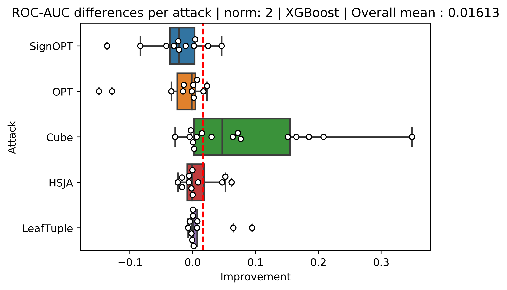
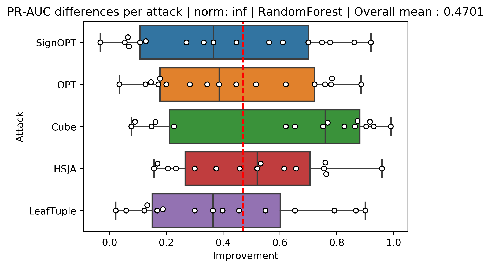
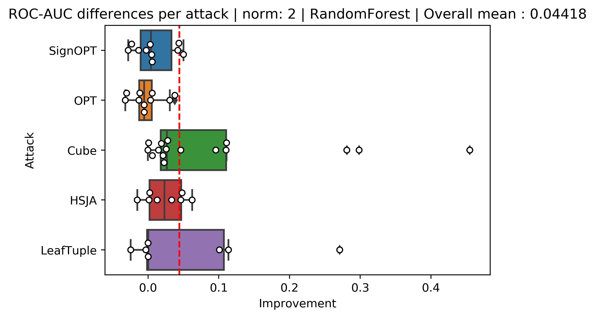

# Adversarial Evasion Attacks Detection for Tree-Based Ensembles: A Representation Learning Approach - Full Experiments Results

# Table of Contents

1. [Full Metrics Differences Figures](#full-metrics-differences-figures)
2. [XGBoost Full Experiments Results](#xgboost-full-experiments-results)
3. [RandomForest Full Experiments Results](#randomforest-full-experiments-results)
4. [Adversarial Samples Information](#adversarial-samples-information)
5. [Detector Ablation Study](#detector-ablation-study)

## Full Metrics Differences Figures

Here are all the different figures comparing our method to OC-Score and a detector based on the original representations of the dataset. For the experiments compared to the OC-score (Figures 1, 2, 3, 4, 5, 6, 7, and 8) the total mean and the median of each section is positive in all of them, which means that our metrics yielded better results for the new representation in most of our experiments. When looking at figures that compare our new method to the original representations (Figures 9, 10, 11, 12, 13, 14, 15 and 16) we can see the ROC-AUC and PR-AUC overall mean of the experiments is positive beside the experiments targeted XGBoost with $L_\infty$ norm which the overall mean is negative.

### Figure 1: 

ROC-AUC differences for XGBoost experiments between our method and OC-score for $L_2$ norm:

### Figure 2: 

PRC-AUC differences for XGBoost experiments between our method and OC-score for $L_2$ norm:

### Figure 3: 

ROC-AUC differences for XGBoost experiments between our method and OC-score for $L_{\infty}$ norm:

### Figure 4: 

PRC-AUC differences for XGBoost experiments between our method and OC-score for $L_{\infty}$ norm:

### Figure 5: 

PRC-AUC differences for XGBoost experiments between the new method and original representation for $L_2$ norm:

### Figure 6: 

ROC-AUC differences for XGBoost experiments between the new method and original representation for $L_{\infty}$ norm:

### Figure 7: 

RC-AUC differences for XGBoost experiments between the new method and original representation for $L_{\infty}$ norm:

### Figure 8: 

PRC-AUC differences for XGBoost experiments between the new method and original representation for $L_{\infty}$ norm:

### Figure 9: 

ROC-AUC differences for RandomForest experiments between our method and OC-score for $L_2$ norm:

### Figure 10: 

PRC-AUC differences for RandomForest experiments between our method and OC-score for $L_2$ norm:

### Figure 11: 

OC-AUC differences for RandomForest experiments between our method and OC-score for $L_{\infty}$ norm:

### Figure 12: 

PRC-AUC differences for RandomForest experiments between our method and OC-score for $L_{\infty}$ norm:

### Figure 13: 

ROC-AUC differences for RandomForest experiments between the new method and original representation for $L_2$ norm:

### Figure 14: 

PRC-AUC differences for RandomForest experiments between the new method and original representation for $L_2$ norm:

### Figure 15: 

ROC-AUC differences for RandomForest experiments between the new method and original representation for $L_{\infty}$ norm:

### Figure 16:

PRC-AUC differences for RandomForest experiments between the new method and original representation for $L_{\infty}$ norm:

## XGBoost Full Experiments Results

In Tables 1,2,3,4 and 5 we can see the raw metrics of the experiments for each dataset, attack method, and norm for the XGBoost target experiments. In bold is the method or methods that achieved the highest value. Rows that fill in hyphens are cases where the adversarial sample creation process failed.

### Table 1: Sign-OPT XGBoost Experiments Results

<table>
  <thead>
    <tr>
      <th rowspan="2"></th>
      <th colspan="6">Sign-OPT $L_2$ </th>
      <th colspan="6">Sign-OPT $L_\infty$ </th>
    </tr>
    <tr>
      <th colspan="3">PRC-AUC</th>
      <th colspan="3">ROC-AUC</th>
      <th colspan="3">PRC-AUC</th>
      <th colspan="3">ROC-AUC</th>
    </tr>
    <tr>
      <th>Dataset</th>
      <th>New</th>
      <th>Original</th>
      <th>OC-score</th>
      <th>New</th>
      <th>Original</th>
      <th>OC-score</th>
      <th>New</th>
      <th>Original</th>
      <th>OC-score</th>
      <th>New</th>
      <th>Original</th>
      <th>OC-score</th>
    </tr>
  </thead>
  <tbody>
    <tr>
      <td>breast-cancer</td>
      <td>0.988</td>
      <td><strong><u>0.9919</u></strong></td>
      <td>0.958</td>
      <td>0.987</td>
      <td><strong><u>0.9919</u></strong></td>
      <td>0.965</td>
      <td><strong><u>0.9971</u></strong></td>
      <td>0.997</td>
      <td>0.960</td>
      <td><strong><u>0.997</u></strong></td>
      <td><strong><u>0.997</u></strong></td>
      <td>0.970</td>
    </tr>
    <tr>
      <td>covtype</td>
      <td><strong><u>1.0</u></strong></td>
      <td><strong><u>1.0</u></strong></td>
      <td>0.049</td>
      <td><strong><u>1.0</u></strong></td>
      <td><strong><u>1.0</u></strong></td>
      <td>0.843</td>
      <td><strong><u>1.0</u></strong></td>
      <td><strong><u>1.0</u></strong></td>
      <td>0.053</td>
      <td><strong><u>1.0</u></strong></td>
      <td><strong><u>1.0</u></strong></td>
      <td>0.833</td>
    </tr>
    <tr>
      <td>cod-rna</td>
      <td>0.743</td>
      <td><strong><u>0.7655</u></strong></td>
      <td>0.161</td>
      <td><strong><u>0.9795</u></strong></td>
      <td>0.955</td>
      <td>0.880</td>
      <td><strong><u>0.7773</u></strong></td>
      <td>0.599</td>
      <td>0.238</td>
      <td><strong><u>0.9808</u></strong></td>
      <td>0.936</td>
      <td>0.889</td>
    </tr>
    <tr>
      <td>diabetes</td>
      <td>0.672</td>
      <td><strong><u>0.855</u></strong></td>
      <td>0.730</td>
      <td>0.707</td>
      <td><strong><u>0.8432</u></strong></td>
      <td>0.772</td>
      <td>0.580</td>
      <td><strong><u>0.8668</u></strong></td>
      <td>0.445</td>
      <td>0.702</td>
      <td><strong><u>0.8678</u></strong></td>
      <td>0.615</td>
    </tr>
    <tr>
      <td>Fashion-MNIST</td>
      <td><strong><u>1.0</u></strong></td>
      <td><strong><u>1.0</u></strong></td>
      <td>0.157</td>
      <td><strong><u>1.0</u></strong></td>
      <td><strong><u>1.0</u></strong></td>
      <td>0.839</td>
      <td><strong><u>0.9999</u></strong></td>
      <td><strong><u>0.9999</u></strong></td>
      <td>0.237</td>
      <td><strong><u>1.0</u></strong></td>
      <td><strong><u>1.0</u></strong></td>
      <td>0.908</td>
    </tr>
    <tr>
      <td>ijcnn1</td>
      <td><strong><u>1.0</u></strong></td>
      <td><strong><u>1.0</u></strong></td>
      <td>0.181</td>
      <td><strong><u>1.0</u></strong></td>
      <td><strong><u>1.0</u></strong></td>
      <td>0.907</td>
      <td><strong><u>1.0</u></strong></td>
      <td><strong><u>1.0</u></strong></td>
      <td>0.276</td>
      <td><strong><u>1.0</u></strong></td>
      <td><strong><u>1.0</u></strong></td>
      <td>0.935</td>
    </tr>
    <tr>
      <td>MNIST</td>
      <td><strong><u>1.0</u></strong></td>
      <td><strong><u>1.0</u></strong></td>
      <td>0.327</td>
      <td><strong><u>1.0</u></strong></td>
      <td><strong><u>1.0</u></strong></td>
      <td>0.945</td>
      <td><strong><u>1.0</u></strong></td>
      <td><strong><u>1.0</u></strong></td>
      <td>0.434</td>
      <td><strong><u>1.0</u></strong></td>
      <td><strong><u>1.0</u></strong></td>
      <td>0.960</td>
    </tr>
    <tr>
      <td>MNIST2-6</td>
      <td><strong><u>0.9999</u></strong></td>
      <td><strong><u>0.9999</u></strong></td>
      <td>0.994</td>
      <td><strong><u>1.0</u></strong></td>
      <td><strong><u>1.0</u></strong></td>
      <td>0.999</td>
      <td><strong><u>1.0</u></strong></td>
      <td><strong><u>1.0</u></strong></td>
      <td>0.991</td>
      <td><strong><u>1.0</u></strong></td>
      <td><strong><u>1.0</u></strong></td>
      <td>0.999</td>
    </tr>
    <tr>
      <td>Sensorless</td>
      <td>0.887</td>
      <td>0.803</td>
      <td><strong><u>0.9111</u></strong></td>
      <td>0.980</td>
      <td>0.934</td>
      <td><strong><u>0.9982</u></strong></td>
      <td><strong><u>0.9709</u></strong></td>
      <td>0.939</td>
      <td>0.887</td>
      <td>0.997</td>
      <td>0.987</td>
      <td><strong><u>0.9984</u></strong></td>
    </tr>
    <tr>
      <td>webspam</td>
      <td><strong><u>1.0</u></strong></td>
      <td><strong><u>1.0</u></strong></td>
      <td>0.253</td>
      <td><strong><u>1.0</u></strong></td>
      <td><strong><u>1.0</u></strong></td>
      <td>0.985</td>
      <td><strong><u>1.0</u></strong></td>
      <td><strong><u>1.0</u></strong></td>
      <td>0.354</td>
      <td><strong><u>1.0</u></strong></td>
      <td><strong><u>1.0</u></strong></td>
      <td>0.990</td>
    </tr>
    <tr>
      <td>electricity</td>
      <td>0.751</td>
      <td><strong><u>0.9763</u></strong></td>
      <td>0.129</td>
      <td>0.955</td>
      <td><strong><u>0.997</u></strong></td>
      <td>0.883</td>
      <td>0.829</td>
      <td><strong><u>0.9661</u></strong></td>
      <td>0.300</td>
      <td>0.970</td>
      <td><strong><u>0.9968</u></strong></td>
      <td>0.901</td>
    </tr>
    <tr>
      <td>drybean</td>
      <td>0.942</td>
      <td><strong><u>0.9617</u></strong></td>
      <td>0.705</td>
      <td>0.975</td>
      <td><strong><u>0.9862</u></strong></td>
      <td>0.974</td>
      <td><strong><u>0.9585</u></strong></td>
      <td>0.914</td>
      <td>0.796</td>
      <td><strong><u>0.9868</u></strong></td>
      <td>0.955</td>
      <td>0.967</td>
    </tr>
    <tr>
      <td>adult</td>
      <td><strong><u>1.0</u></strong></td>
      <td><strong><u>1.0</u></strong></td>
      <td>0.109</td>
      <td><strong><u>1.0</u></strong></td>
      <td><strong><u>1.0</u></strong></td>
      <td>0.813</td>
      <td><strong><u>1.0</u></strong></td>
      <td><strong><u>1.0</u></strong></td>
      <td>0.128</td>
      <td><strong><u>1.0</u></strong></td>
      <td><strong><u>1.0</u></strong></td>
      <td>0.817</td>
    </tr>
    <tr>
      <td>banknote</td>
      <td>0.968</td>
      <td><strong><u>0.99</u></strong></td>
      <td>0.768</td>
      <td>0.970</td>
      <td><strong><u>0.9918</u></strong></td>
      <td>0.961</td>
      <td><strong><u>0.9699</u></strong></td>
      <td>0.961</td>
      <td>0.798</td>
      <td><strong><u>0.9822</u></strong></td>
      <td>0.982</td>
      <td>0.957</td>
    </tr>
    <tr>
      <td>gender-by-voice</td>
      <td><strong><u>0.9854</u></strong></td>
      <td>0.983</td>
      <td>0.887</td>
      <td><strong><u>0.9897</u></strong></td>
      <td>0.989</td>
      <td>0.978</td>
      <td>0.982</td>
      <td><strong><u>0.9964</u></strong></td>
      <td>0.960</td>
      <td>0.990</td>
      <td><strong><u>0.9975</u></strong></td>
      <td>0.993</td>
    </tr>
    <tr>
      <td>waveform</td>
      <td>0.540</td>
      <td><strong><u>0.5538</u></strong></td>
      <td>0.380</td>
      <td>0.803</td>
      <td>0.801</td>
      <td><strong><u>0.8628</u></strong></td>
      <td>0.467</td>
      <td><strong><u>0.5575</u></strong></td>
      <td>0.461</td>
      <td>0.717</td>
      <td>0.779</td>
      <td><strong><u>0.8665</u></strong></td>
    </tr>
    <tr>
      <td>wind</td>
      <td>0.695</td>
      <td><strong><u>0.8821</u></strong></td>
      <td>0.183</td>
      <td>0.858</td>
      <td><strong><u>0.9414</u></strong></td>
      <td>0.730</td>
      <td>0.526</td>
      <td><strong><u>0.7558</u></strong></td>
      <td>0.205</td>
      <td>0.819</td>
      <td><strong><u>0.8812</u></strong></td>
      <td>0.742</td>
    </tr>
    <tr>
      <td>speech</td>
      <td>0.990</td>
      <td>0.915</td>
      <td><strong><u>1.0</u></strong></td>
      <td>0.999</td>
      <td>0.995</td>
      <td><strong><u>1.0</u></strong></td>
      <td><strong><u>0.9943</u></strong></td>
      <td>0.965</td>
      <td>0.967</td>
      <td><strong><u>0.9987</u></strong></td>
      <td>0.990</td>
      <td>0.998</td>
    </tr>
  </tbody>
</table>
  

### Table 2: OPT XGBoost Experiments Results

<table>
  <thead>
    <tr>
      <th rowspan="2"></th>
      <th colspan="6">OPT $L_2$ </th>
      <th colspan="6">OPT $L_\infty$ </th>
    </tr>
    <tr>
      <th colspan="3">PRC-AUC</th>
      <th colspan="3">ROC-AUC</th>
      <th colspan="3">PRC-AUC</th>
      <th colspan="3">ROC-AUC</th>
    </tr>
    <tr>
      <th>Dataset</th>
      <th>New</th>
      <th>Original</th>
      <th>OC-score</th>
      <th>New</th>
      <th>Original</th>
      <th>OC-score</th>
      <th>New</th>
      <th>Original</th>
      <th>OC-score</th>
      <th>New</th>
      <th>Original</th>
      <th>OC-score</th>
    </tr>
  </thead>
  <tbody>
    <tr>
      <td>breast-cancer</td>
      <td>0.992</td>
      <td><strong><u>0.9956</u></strong></td>
      <td>0.867</td>
      <td>0.992</td>
      <td><strong><u>0.9952</u></strong></td>
      <td>0.925</td>
      <td>0.973</td>
      <td><strong><u>0.9737</u></strong></td>
      <td>0.920</td>
      <td><strong><u>0.9788</u></strong></td>
      <td>0.978</td>
      <td>0.968</td>
    </tr>
    <tr>
      <td>covtype</td>
      <td><strong><u>1.0</u></strong></td>
      <td><strong><u>1.0</u></strong></td>
      <td>0.056</td>
      <td><strong><u>1.0</u></strong></td>
      <td><strong><u>1.0</u></strong></td>
      <td>0.768</td>
      <td><strong><u>1.0</u></strong></td>
      <td><strong><u>1.0</u></strong></td>
      <td>0.072</td>
      <td><strong><u>1.0</u></strong></td>
      <td><strong><u>1.0</u></strong></td>
      <td>0.856</td>
    </tr>
    <tr>
      <td>cod-rna</td>
      <td><strong><u>0.804</u></strong></td>
      <td>0.716</td>
      <td>0.183</td>
      <td><strong><u>0.9808</u></strong></td>
      <td>0.958</td>
      <td>0.892</td>
      <td><strong><u>0.8035</u></strong></td>
      <td>0.647</td>
      <td>0.234</td>
      <td><strong><u>0.9774</u></strong></td>
      <td>0.953</td>
      <td>0.907</td>
    </tr>
    <tr>
      <td>diabetes</td>
      <td>0.652</td>
      <td><strong><u>0.8434</u></strong></td>
      <td>0.594</td>
      <td>0.675</td>
      <td><strong><u>0.8612</u></strong></td>
      <td>0.741</td>
      <td><strong><u>0.8455</u></strong></td>
      <td>0.751</td>
      <td>0.699</td>
      <td><strong><u>0.8174</u></strong></td>
      <td>0.745</td>
      <td>0.736</td>
    </tr>
    <tr>
      <td>Fashion-MNIST</td>
      <td><strong><u>1.0</u></strong></td>
      <td><strong><u>1.0</u></strong></td>
      <td>0.370</td>
      <td><strong><u>1.0</u></strong></td>
      <td><strong><u>1.0</u></strong></td>
      <td>0.923</td>
      <td><strong><u>1.0</u></strong></td>
      <td><strong><u>1.0</u></strong></td>
      <td>0.445</td>
      <td><strong><u>1.0</u></strong></td>
      <td><strong><u>1.0</u></strong></td>
      <td>0.936</td>
    </tr>
    <tr>
      <td>ijcnn1</td>
      <td><strong><u>1.0</u></strong></td>
      <td><strong><u>1.0</u></strong></td>
      <td>0.273</td>
      <td><strong><u>1.0</u></strong></td>
      <td><strong><u>1.0</u></strong></td>
      <td>0.926</td>
      <td><strong><u>1.0</u></strong></td>
      <td><strong><u>1.0</u></strong></td>
      <td>0.246</td>
      <td><strong><u>1.0</u></strong></td>
      <td><strong><u>1.0</u></strong></td>
      <td>0.941</td>
    </tr>
    <tr>
      <td>MNIST</td>
      <td><strong><u>1.0</u></strong></td>
      <td><strong><u>1.0</u></strong></td>
      <td>0.476</td>
      <td><strong><u>1.0</u></strong></td>
      <td><strong><u>1.0</u></strong></td>
      <td>0.971</td>
      <td><strong><u>1.0</u></strong></td>
      <td><strong><u>1.0</u></strong></td>
      <td>0.566</td>
      <td><strong><u>1.0</u></strong></td>
      <td><strong><u>1.0</u></strong></td>
      <td>0.975</td>
    </tr>
    <tr>
      <td>MNIST2-6</td>
      <td><strong><u>1.0</u></strong></td>
      <td><strong><u>1.0</u></strong></td>
      <td>0.996</td>
      <td><strong><u>1.0</u></strong></td>
      <td><strong><u>1.0</u></strong></td>
      <td><strong><u>1.0</u></strong></td>
      <td><strong><u>1.0</u></strong></td>
      <td><strong><u>1.0</u></strong></td>
      <td>0.986</td>
      <td><strong><u>1.0</u></strong></td>
      <td><strong><u>1.0</u></strong></td>
      <td>0.999</td>
    </tr>
    <tr>
      <td>sensorless</td>
      <td><strong><u>0.9929</u></strong></td>
      <td>0.974</td>
      <td>0.883</td>
      <td><strong><u>0.9998</u></strong></td>
      <td>0.999</td>
      <td>0.999</td>
      <td><strong><u>0.9871</u></strong></td>
      <td>0.965</td>
      <td>0.877</td>
      <td><strong><u>0.999</u></strong></td>
      <td>0.993</td>
      <td>0.998</td>
    </tr>
    <tr>
      <td>webspam</td>
      <td><strong><u>1.0</u></strong></td>
      <td><strong><u>1.0</u></strong></td>
      <td>0.399</td>
      <td><strong><u>1.0</u></strong></td>
      <td><strong><u>1.0</u></strong></td>
      <td>0.992</td>
      <td><strong><u>1.0</u></strong></td>
      <td><strong><u>1.0</u></strong></td>
      <td>0.387</td>
      <td><strong><u>1.0</u></strong></td>
      <td><strong><u>1.0</u></strong></td>
      <td>0.991</td>
    </tr>
    <tr>
      <td>electricity</td>
      <td>0.774</td>
      <td><strong><u>0.8818</u></strong></td>
      <td>0.248</td>
      <td>0.948</td>
      <td><strong><u>0.982</u></strong></td>
      <td>0.887</td>
      <td>0.852</td>
      <td><strong><u>0.891</u></strong></td>
      <td>0.286</td>
      <td><strong><u>0.9731</u></strong></td>
      <td>0.960</td>
      <td>0.904</td>
    </tr>
    <tr>
      <td>drybean</td>
      <td><strong><u>0.9536</u></strong></td>
      <td>0.935</td>
      <td>0.848</td>
      <td><strong><u>0.9861</u></strong></td>
      <td>0.969</td>
      <td>0.984</td>
      <td><strong><u>0.9396</u></strong></td>
      <td>0.934</td>
      <td>0.877</td>
      <td>0.964</td>
      <td>0.970</td>
      <td><strong><u>0.9869</u></strong></td>
    </tr>
    <tr>
      <td>adult</td>
      <td><strong><u>1.0</u></strong></td>
      <td><strong><u>1.0</u></strong></td>
      <td>0.076</td>
      <td><strong><u>1.0</u></strong></td>
      <td><strong><u>1.0</u></strong></td>
      <td>0.791</td>
      <td><strong><u>1.0</u></strong></td>
      <td><strong><u>1.0</u></strong></td>
      <td>0.058</td>
      <td><strong><u>1.0</u></strong></td>
      <td><strong><u>1.0</u></strong></td>
      <td>0.702</td>
    </tr>
    <tr>
      <td>banknote</td>
      <td><strong><u>0.9893</u></strong></td>
      <td>0.950</td>
      <td>0.911</td>
      <td><strong><u>0.9906</u></strong></td>
      <td>0.984</td>
      <td>0.976</td>
      <td><strong><u>0.956</u></strong></td>
      <td>0.942</td>
      <td>0.876</td>
      <td>0.974</td>
      <td>0.967</td>
      <td><strong><u>0.9767</u></strong></td>
    </tr>
    <tr>
      <td>gender-by-voice</td>
      <td>0.964</td>
      <td><strong><u>0.9943</u></strong></td>
      <td>0.812</td>
      <td>0.981</td>
      <td><strong><u>0.9964</u></strong></td>
      <td>0.964</td>
      <td>0.976</td>
      <td><strong><u>0.9926</u></strong></td>
      <td>0.842</td>
      <td>0.987</td>
      <td><strong><u>0.9951</u></strong></td>
      <td>0.974</td>
    </tr>
    <tr>
      <td>waveform</td>
      <td>0.538</td>
      <td><strong><u>0.6195</u></strong></td>
      <td>0.392</td>
      <td>0.784</td>
      <td>0.777</td>
      <td><strong><u>0.8524</u></strong></td>
      <td>0.590</td>
      <td><strong><u>0.6673</u></strong></td>
      <td>0.395</td>
      <td>0.819</td>
      <td>0.800</td>
      <td><strong><u>0.8813</u></strong></td>
    </tr>
    <tr>
      <td>wind</td>
      <td>0.476</td>
      <td><strong><u>0.7908</u></strong></td>
      <td>0.210</td>
      <td>0.777</td>
      <td><strong><u>0.9054</u></strong></td>
      <td>0.785</td>
      <td>0.423</td>
      <td><strong><u>0.7694</u></strong></td>
      <td>0.176</td>
      <td>0.755</td>
      <td><strong><u>0.8653</u></strong></td>
      <td>0.729</td>
    </tr>
    <tr>
      <td>speech</td>
      <td><strong><u>0.9917</u></strong></td>
      <td>0.983</td>
      <td>0.973</td>
      <td><strong><u>0.9986</u></strong></td>
      <td>0.997</td>
      <td>0.998</td>
      <td><strong><u>0.9957</u></strong></td>
      <td>0.799</td>
      <td>0.984</td>
      <td>0.9996</td>
      <td>0.977</td>
      <td><strong><u>1.0</u></strong></td>
    </tr>
  </tbody>
</table>

### Table 3: HSJA XGBoost Experiments Results

<table>
  <thead>
    <tr>
      <th rowspan="2"></th>
      <th colspan="6">HSJA $L_2$ </th>
      <th colspan="6">HSJA $L_\infty$ </th>
    </tr>
    <tr>
      <th colspan="3">PRC-AUC</th>
      <th colspan="3">ROC-AUC</th>
      <th colspan="3">PRC-AUC</th>
      <th colspan="3">ROC-AUC</th>
    </tr>
    <tr>
      <th>Dataset</th>
      <th>New</th>
      <th>Original</th>
      <th>OC-score</th>
      <th>New</th>
      <th>Original</th>
      <th>OC-score</th>
      <th>New</th>
      <th>Original</th>
      <th>OC-score</th>
      <th>New</th>
      <th>Original</th>
      <th>OC-score</th>
    </tr>
  </thead>
  <tbody>
    <tr>
      <td>breast-cancer</td>
      <td><strong><u>0.9909</u></strong></td>
      <td>0.988</td>
      <td>0.799</td>
      <td><strong><u>0.9905</u></strong></td>
      <td>0.988</td>
      <td>0.923</td>
      <td>0.982</td>
      <td><strong><u>0.9956</u></strong></td>
      <td>0.934</td>
      <td>0.987</td>
      <td><strong><u>0.9958</u></strong></td>
      <td>0.954</td>
    </tr>
    <tr>
      <td>covtype</td>
      <td><strong><u>1.0</u></strong></td>
      <td><strong><u>1.0</u></strong></td>
      <td>0.159</td>
      <td><strong><u>1.0</u></strong></td>
      <td><strong><u>1.0</u></strong></td>
      <td>0.832</td>
      <td><strong><u>1.0</u></strong></td>
      <td><strong><u>1.0</u></strong></td>
      <td>0.230</td>
      <td><strong><u>1.0</u></strong></td>
      <td><strong><u>1.0</u></strong></td>
      <td>0.811</td>
    </tr>
    <tr>
      <td>cod-rna</td>
      <td><strong><u>0.8193</u></strong></td>
      <td>0.669</td>
      <td>0.107</td>
      <td><strong><u>0.9879</u></strong></td>
      <td>0.926</td>
      <td>0.817</td>
      <td><strong><u>0.8389</u></strong></td>
      <td>0.594</td>
      <td>0.185</td>
      <td><strong><u>0.9891</u></strong></td>
      <td>0.944</td>
      <td>0.847</td>
    </tr>
    <tr>
      <td>diabetes</td>
      <td><strong><u>0.7947</u></strong></td>
      <td>0.786</td>
      <td>0.522</td>
      <td><strong><u>0.834</u></strong></td>
      <td>0.830</td>
      <td>0.708</td>
      <td>0.787</td>
      <td><strong><u>0.8219</u></strong></td>
      <td>0.516</td>
      <td>0.790</td>
      <td><strong><u>0.8325</u></strong></td>
      <td>0.710</td>
    </tr>
    <tr>
      <td>Fashion-MNIST</td>
      <td>0.994</td>
      <td><strong><u>0.998</u></strong></td>
      <td>0.235</td>
      <td><strong><u>1.0</u></strong></td>
      <td><strong><u>1.0</u></strong></td>
      <td>0.881</td>
      <td><strong><u>1.0</u></strong></td>
      <td>0.9997</td>
      <td>0.266</td>
      <td><strong><u>1.0</u></strong></td>
      <td><strong><u>1.0</u></strong></td>
      <td>0.868</td>
    </tr>
    <tr>
      <td>ijcnn1</td>
      <td><strong><u>1.0</u></strong></td>
      <td><strong><u>1.0</u></strong></td>
      <td>0.089</td>
      <td><strong><u>1.0</u></strong></td>
      <td><strong><u>1.0</u></strong></td>
      <td>0.846</td>
      <td><strong><u>1.0</u></strong></td>
      <td><strong><u>1.0</u></strong></td>
      <td>0.132</td>
      <td><strong><u>1.0</u></strong></td>
      <td><strong><u>1.0</u></strong></td>
      <td>0.893</td>
    </tr>
    <tr>
      <td>MNIST</td>
      <td><strong><u>1.0</u></strong></td>
      <td><strong><u>1.0</u></strong></td>
      <td>0.493</td>
      <td><strong><u>1.0</u></strong></td>
      <td><strong><u>1.0</u></strong></td>
      <td>0.954</td>
      <td><strong><u>1.0</u></strong></td>
      <td><strong><u>1.0</u></strong></td>
      <td>0.420</td>
      <td><strong><u>1.0</u></strong></td>
      <td><strong><u>1.0</u></strong></td>
      <td>0.945</td>
    </tr>
    <tr>
      <td>MNIST2-6</td>
      <td><strong><u>1.0</u></strong></td>
      <td><strong><u>1.0</u></strong></td>
      <td>0.965</td>
      <td><strong><u>1.0</u></strong></td>
      <td><strong><u>1.0</u></strong></td>
      <td>0.998</td>
      <td><strong><u>1.0</u></strong></td>
      <td><strong><u>1.0</u></strong></td>
      <td>0.972</td>
      <td><strong><u>1.0</u></strong></td>
      <td><strong><u>1.0</u></strong></td>
      <td>0.998</td>
    </tr>
    <tr>
      <td>sensorless</td>
      <td><strong><u>0.8562</u></strong></td>
      <td>0.729</td>
      <td>0.839</td>
      <td>0.972</td>
      <td>0.920</td>
      <td><strong><u>0.9973</u></strong></td>
      <td><strong><u>0.9175</u></strong></td>
      <td>0.782</td>
      <td>0.893</td>
      <td>0.990</td>
      <td>0.934</td>
      <td><strong><u>0.9984</u></strong></td>
    </tr>
    <tr>
      <td>webspam</td>
      <td><strong><u>0.9859</u></strong></td>
      <td>0.986</td>
      <td>0.232</td>
      <td>0.9999</td>
      <td><strong><u>1.0</u></strong></td>
      <td>0.986</td>
      <td><strong><u>1.0</u></strong></td>
      <td><strong><u>1.0</u></strong></td>
      <td>0.212</td>
      <td><strong><u>1.0</u></strong></td>
      <td><strong><u>1.0</u></strong></td>
      <td>0.984</td>
    </tr>
    <tr>
      <td>electricity</td>
      <td>0.795</td>
      <td><strong><u>0.9084</u></strong></td>
      <td>0.098</td>
      <td>0.962</td>
      <td><strong><u>0.9789</u></strong></td>
      <td>0.824</td>
      <td><strong><u>0.8877</u></strong></td>
      <td>0.853</td>
      <td>0.189</td>
      <td><strong><u>0.9841</u></strong></td>
      <td>0.953</td>
      <td>0.852</td>
    </tr>
    <tr>
      <td>drybean</td>
      <td><strong><u>0.9568</u></strong></td>
      <td>0.943</td>
      <td>0.872</td>
      <td><strong><u>0.9826</u></strong></td>
      <td>0.974</td>
      <td>0.977</td>
      <td><strong><u>0.9561</u></strong></td>
      <td>0.953</td>
      <td>0.846</td>
      <td><strong><u>0.9795</u></strong></td>
      <td>0.979</td>
      <td>0.978</td>
    </tr>
    <tr>
      <td>adult</td>
      <td><strong><u>1.0</u></strong></td>
      <td><strong><u>1.0</u></strong></td>
      <td>0.458</td>
      <td><strong><u>1.0</u></strong></td>
      <td><strong><u>1.0</u></strong></td>
      <td>0.905</td>
      <td><strong><u>1.0</u></strong></td>
      <td><strong><u>1.0</u></strong></td>
      <td>0.366</td>
      <td><strong><u>1.0</u></strong></td>
      <td><strong><u>1.0</u></strong></td>
      <td>0.883</td>
    </tr>
    <tr>
      <td>banknote</td>
      <td><strong><u>0.8879</u></strong></td>
      <td>0.851</td>
      <td>0.742</td>
      <td>0.889</td>
      <td><strong><u>0.9017</u></strong></td>
      <td>0.901</td>
      <td>0.895</td>
      <td><strong><u>0.901</u></strong></td>
      <td>0.658</td>
      <td><strong><u>0.9265</u></strong></td>
      <td>0.907</td>
      <td>0.869</td>
    </tr>
    <tr>
      <td>gender-by-voice</td>
      <td>0.920</td>
      <td><strong><u>0.9668</u></strong></td>
      <td>0.787</td>
      <td>0.952</td>
      <td><strong><u>0.9758</u></strong></td>
      <td>0.962</td>
      <td>0.961</td>
      <td><strong><u>0.9882</u></strong></td>
      <td>0.721</td>
      <td>0.975</td>
      <td><strong><u>0.9927</u></strong></td>
      <td>0.947</td>
    </tr>
    <tr>
      <td>waveform</td>
      <td><strong><u>0.6012</u></strong></td>
      <td>0.592</td>
      <td>0.493</td>
      <td>0.774</td>
      <td>0.768</td>
      <td><strong><u>0.883</u></strong></td>
      <td>0.680</td>
      <td><strong><u>0.692</u></strong></td>
      <td>0.372</td>
      <td><strong><u>0.8323</u></strong></td>
      <td>0.815</td>
      <td>0.831</td>
    </tr>
    <tr>
      <td>wind</td>
      <td>0.763</td>
      <td><strong><u>0.7846</u></strong></td>
      <td>0.309</td>
      <td>0.881</td>
      <td><strong><u>0.8814</u></strong></td>
      <td>0.824</td>
      <td>0.712</td>
      <td><strong><u>0.8311</u></strong></td>
      <td>0.328</td>
      <td>0.870</td>
      <td><strong><u>0.9151</u></strong></td>
      <td>0.789</td>
    </tr>
    <tr>
      <td>speech</td>
      <td><strong><u>0.9965</u></strong></td>
      <td>0.994</td>
      <td>0.989</td>
      <td><strong><u>0.9993</u></strong></td>
      <td>0.999</td>
      <td>0.999</td>
      <td>0.996</td>
      <td>0.994</td>
      <td><strong><u>0.9995</u></strong></td>
      <td>0.999</td>
      <td>0.998</td>
      <td><strong><u>1.0</u></strong></td>
    </tr>
  </tbody>
</table>

### Table 4: Cube XGBoost Experiments Results

<table>
  <thead>
    <tr>
      <th rowspan="2"></th>
      <th colspan="6">Cube $L_2$ </th>
      <th colspan="6">Cube $L_\infty$ </th>
    </tr>
    <tr>
      <th colspan="3">PRC-AUC</th>
      <th colspan="3">ROC-AUC</th>
      <th colspan="3">PRC-AUC</th>
      <th colspan="3">ROC-AUC</th>
    </tr>
    <tr>
      <th>Dataset</th>
      <th>New</th>
      <th>Original</th>
      <th>OC-score</th>
      <th>New</th>
      <th>Original</th>
      <th>OC-score</th>
      <th>New</th>
      <th>Original</th>
      <th>OC-score</th>
      <th>New</th>
      <th>Original</th>
      <th>OC-score</th>
    </tr>
  </thead>
  <tbody>
    <tr>
      <td>breast-cancer</td>
      <td>0.537</td>
      <td>0.212</td>
      <td><strong><u>0.7413</u></strong></td>
      <td>0.756</td>
      <td>0.591</td>
      <td><strong><u>0.8878</u></strong></td>
      <td>0.869</td>
      <td><strong><u>0.9257</u></strong></td>
      <td>0.303</td>
      <td>0.931</td>
      <td><strong><u>0.9665</u></strong></td>
      <td>0.575</td>
    </tr>
    <tr>
      <td>covtype</td>
      <td><strong><u>0.9823</u></strong></td>
      <td>0.020</td>
      <td>0.045</td>
      <td><strong><u>0.9998</u></strong></td>
      <td>0.649</td>
      <td>0.838</td>
      <td><strong><u>1.0</u></strong></td>
      <td><strong><u>1.0</u></strong></td>
      <td>0.043</td>
      <td><strong><u>1.0</u></strong></td>
      <td><strong><u>1.0</u></strong></td>
      <td>0.893</td>
    </tr>
    <tr>
      <td>cod-rna</td>
      <td><strong><u>0.7678</u></strong></td>
      <td>0.212</td>
      <td>0.183</td>
      <td><strong><u>0.985</u></strong></td>
      <td>0.800</td>
      <td>0.873</td>
      <td><strong><u>0.8643</u></strong></td>
      <td>0.732</td>
      <td>0.343</td>
      <td><strong><u>0.9841</u></strong></td>
      <td>0.944</td>
      <td>0.915</td>
    </tr>
    <tr>
      <td>diabetes</td>
      <td><strong><u>0.5437</u></strong></td>
      <td>0.458</td>
      <td>0.258</td>
      <td><strong><u>0.7935</u></strong></td>
      <td>0.717</td>
      <td>0.724</td>
      <td>0.567</td>
      <td><strong><u>0.6097</u></strong></td>
      <td>0.532</td>
      <td><strong><u>0.7316</u></strong></td>
      <td>0.667</td>
      <td>0.710</td>
    </tr>
    <tr>
      <td>Fashion-MNIST</td>
      <td><strong><u>0.9094</u></strong></td>
      <td>0.538</td>
      <td>0.098</td>
      <td><strong><u>0.9951</u></strong></td>
      <td>0.798</td>
      <td>0.850</td>
      <td><strong><u>0.8929</u></strong></td>
      <td>0.750</td>
      <td>0.014</td>
      <td><strong><u>0.9996</u></strong></td>
      <td>0.999</td>
      <td>0.903</td>
    </tr>
    <tr>
      <td>ijcnn1</td>
      <td><strong><u>0.773</u></strong></td>
      <td>0.310</td>
      <td>0.246</td>
      <td><strong><u>0.987</u></strong></td>
      <td>0.915</td>
      <td>0.905</td>
      <td>0.998</td>
      <td><strong><u>0.9998</u></strong></td>
      <td>0.216</td>
      <td><strong><u>1.0</u></strong></td>
      <td><strong><u>1.0</u></strong></td>
      <td>0.912</td>
    </tr>
    <tr>
      <td>MNIST</td>
      <td><strong><u>0.7755</u></strong></td>
      <td>0.263</td>
      <td>0.202</td>
      <td><strong><u>0.9846</u></strong></td>
      <td>0.735</td>
      <td>0.926</td>
      <td><strong><u>1.0</u></strong></td>
      <td><strong><u>1.0</u></strong></td>
      <td>0.028</td>
      <td><strong><u>1.0</u></strong></td>
      <td><strong><u>1.0</u></strong></td>
      <td>0.917</td>
    </tr>
    <tr>
      <td>MNIST2-6</td>
      <td>0.968</td>
      <td><strong><u>0.9853</u></strong></td>
      <td>0.977</td>
      <td>0.990</td>
      <td>0.995</td>
      <td><strong><u>0.9979</u></strong></td>
      <td><strong><u>1.0</u></strong></td>
      <td><strong><u>1.0</u></strong></td>
      <td>0.987</td>
      <td><strong><u>1.0</u></strong></td>
      <td><strong><u>1.0</u></strong></td>
      <td>0.999</td>
    </tr>
    <tr>
      <td>sensorless</td>
      <td><strong><u>0.8793</u></strong></td>
      <td>0.650</td>
      <td>0.595</td>
      <td>0.994</td>
      <td>0.916</td>
      <td><strong><u>0.9961</u></strong></td>
      <td><strong><u>1.0</u></strong></td>
      <td><strong><u>1.0</u></strong></td>
      <td>0.770</td>
      <td><strong><u>1.0</u></strong></td>
      <td><strong><u>1.0</u></strong></td>
      <td>0.996</td>
    </tr>
    <tr>
      <td>webspam</td>
      <td><strong><u>0.9185</u></strong></td>
      <td>0.843</td>
      <td>0.297</td>
      <td><strong><u>0.9987</u></strong></td>
      <td>0.984</td>
      <td>0.990</td>
      <td><strong><u>0.9994</u></strong></td>
      <td><strong><u>0.9994</u></strong></td>
      <td>0.390</td>
      <td><strong><u>1.0</u></strong></td>
      <td><strong><u>1.0</u></strong></td>
      <td>0.990</td>
    </tr>
    <tr>
      <td>electricity</td>
      <td><strong><u>0.7746</u></strong></td>
      <td>0.671</td>
      <td>0.312</td>
      <td><strong><u>0.9666</u></strong></td>
      <td>0.887</td>
      <td>0.904</td>
      <td><strong><u>0.9931</u></strong></td>
      <td>0.986</td>
      <td>0.652</td>
      <td><strong><u>0.9996</u></strong></td>
      <td>0.995</td>
      <td>0.969</td>
    </tr>
    <tr>
      <td>drybean</td>
      <td><strong><u>0.9954</u></strong></td>
      <td>0.987</td>
      <td>0.720</td>
      <td><strong><u>0.9996</u></strong></td>
      <td>0.999</td>
      <td>0.975</td>
      <td><strong><u>1.0</u></strong></td>
      <td><strong><u>1.0</u></strong></td>
      <td>0.610</td>
      <td><strong><u>1.0</u></strong></td>
      <td><strong><u>1.0</u></strong></td>
      <td>0.937</td>
    </tr>
    <tr>
      <td>adult</td>
      <td>0.944</td>
      <td><strong><u>0.9454</u></strong></td>
      <td>0.315</td>
      <td><strong><u>0.993</u></strong></td>
      <td>0.985</td>
      <td>0.941</td>
      <td><strong><u>1.0</u></strong></td>
      <td><strong><u>1.0</u></strong></td>
      <td>0.551</td>
      <td><strong><u>1.0</u></strong></td>
      <td><strong><u>1.0</u></strong></td>
      <td>0.998</td>
    </tr>
    <tr>
      <td>banknote</td>
      <td><strong><u>0.6201</u></strong></td>
      <td>0.538</td>
      <td>0.469</td>
      <td>0.971</td>
      <td>0.862</td>
      <td><strong><u>0.9893</u></strong></td>
      <td><strong><u>0.9973</u></strong></td>
      <td><strong><u>0.9973</u></strong></td>
      <td>0.364</td>
      <td><strong><u>0.9992</u></strong></td>
      <td><strong><u>0.9992</u></strong></td>
      <td>0.923</td>
    </tr>
    <tr>
      <td>gender-by-voice</td>
      <td>0.811</td>
      <td><strong><u>0.866</u></strong></td>
      <td>0.663</td>
      <td>0.915</td>
      <td>0.943</td>
      <td><strong><u>0.9439</u></strong></td>
      <td><strong><u>1.0</u></strong></td>
      <td><strong><u>1.0</u></strong></td>
      <td>0.117</td>
      <td><strong><u>1.0</u></strong></td>
      <td><strong><u>1.0</u></strong></td>
      <td>0.671</td>
    </tr>
    <tr>
      <td>waveform</td>
      <td><strong><u>0.9614</u></strong></td>
      <td>0.959</td>
      <td>0.426</td>
      <td><strong><u>0.9754</u></strong></td>
      <td>0.969</td>
      <td>0.838</td>
      <td><strong><u>1.0</u></strong></td>
      <td><strong><u>1.0</u></strong></td>
      <td>0.188</td>
      <td><strong><u>1.0</u></strong></td>
      <td><strong><u>1.0</u></strong></td>
      <td>0.705</td>
    </tr>
    <tr>
      <td>wind</td>
      <td><strong><u>1.0</u></strong></td>
      <td><strong><u>1.0</u></strong></td>
      <td>0.754</td>
      <td><strong><u>1.0</u></strong></td>
      <td><strong><u>1.0</u></strong></td>
      <td>0.966</td>
      <td><strong><u>1.0</u></strong></td>
      <td><strong><u>1.0</u></strong></td>
      <td>0.017</td>
      <td><strong><u>1.0</u></strong></td>
      <td><strong><u>1.0</u></strong></td>
      <td>0.119</td>
    </tr>
    <tr>
      <td>speech</td>
      <td>-</td>
      <td>-</td>
      <td>-</td>
      <td>-</td>
      <td>-</td>
      <td>-</td>
      <td>-</td>
      <td>-</td>
      <td>-</td>
      <td>-</td>
      <td>-</td>
      <td>-</td>
    </tr>
  </tbody>
</table>

### Table 5: Leaf-Tuple XGBoost Experiments Results

<table>
  <thead>
    <tr>
      <th rowspan="2"></th>
      <th colspan="6">Leaf-Tuple $L_2$ </th>
      <th colspan="6">Leaf-Tuple $L_\infty$ </th>
    </tr>
    <tr>
      <th colspan="3">PRC-AUC</th>
      <th colspan="3">ROC-AUC</th>
      <th colspan="3">PRC-AUC</th>
      <th colspan="3">ROC-AUC</th>
    </tr>
    <tr>
      <th>Dataset</th>
      <th>New</th>
      <th>Original</th>
      <th>OC-score</th>
      <th>New</th>
      <th>Original</th>
      <th>OC-score</th>
      <th>New</th>
      <th>Original</th>
      <th>OC-score</th>
      <th>New</th>
      <th>Original</th>
      <th>OC-score</th>
    </tr>
  </thead>
  <tbody>
    <tr>
      <td>breast-cancer</td>
      <td><strong><u>0.9954</u></strong></td>
      <td>0.989</td>
      <td>0.921</td>
      <td><strong><u>0.9954</u></strong></td>
      <td>0.988</td>
      <td>0.915</td>
      <td>0.871</td>
      <td>0.835</td>
      <td><strong><u>0.9399</u></strong></td>
      <td>0.893</td>
      <td>0.854</td>
      <td><strong><u>0.9356</u></strong></td>
    </tr>
    <tr>
      <td>covtype</td>
      <td><strong><u>0.9962</u></strong></td>
      <td>0.723</td>
      <td>0.118</td>
      <td><strong><u>0.9995</u></strong></td>
      <td>0.934</td>
      <td>0.761</td>
      <td><strong><u>0.9969</u></strong></td>
      <td>0.783</td>
      <td>0.110</td>
      <td><strong><u>0.9999</u></strong></td>
      <td>0.950</td>
      <td>0.782</td>
    </tr>
    <tr>
      <td>cod-rna</td>
      <td>0.932</td>
      <td><strong><u>0.9477</u></strong></td>
      <td>0.540</td>
      <td>0.981</td>
      <td><strong><u>0.9822</u></strong></td>
      <td>0.861</td>
      <td>0.951</td>
      <td><strong><u>0.97</u></strong></td>
      <td>0.614</td>
      <td>0.986</td>
      <td><strong><u>0.9891</u></strong></td>
      <td>0.891</td>
    </tr>
    <tr>
      <td>diabetes</td>
      <td><strong><u>0.7227</u></strong></td>
      <td>0.653</td>
      <td>0.557</td>
      <td><strong><u>0.7826</u></strong></td>
      <td>0.688</td>
      <td>0.685</td>
      <td>0.561</td>
      <td><strong><u>0.5782</u></strong></td>
      <td>0.419</td>
      <td>0.643</td>
      <td><strong><u>0.6522</u></strong></td>
      <td>0.611</td>
    </tr>
    <tr>
      <td>Fashion-MNIST</td>
      <td><strong><u>0.9627</u></strong></td>
      <td>0.948</td>
      <td>0.367</td>
      <td><strong><u>0.9891</u></strong></td>
      <td>0.973</td>
      <td>0.759</td>
      <td><strong><u>0.9544</u></strong></td>
      <td>0.951</td>
      <td>0.393</td>
      <td><strong><u>0.9868</u></strong></td>
      <td>0.978</td>
      <td>0.786</td>
    </tr>
    <tr>
      <td>ijcnn1</td>
      <td>0.946</td>
      <td><strong><u>0.9584</u></strong></td>
      <td>0.668</td>
      <td>0.984</td>
      <td><strong><u>0.9867</u></strong></td>
      <td>0.906</td>
      <td>0.960</td>
      <td><strong><u>0.9711</u></strong></td>
      <td>0.744</td>
      <td>0.988</td>
      <td><strong><u>0.9899</u></strong></td>
      <td>0.935</td>
    </tr>
    <tr>
      <td>MNIST</td>
      <td>0.995</td>
      <td><strong><u>0.9953</u></strong></td>
      <td>0.410</td>
      <td><strong><u>0.9982</u></strong></td>
      <td>0.997</td>
      <td>0.773</td>
      <td><strong><u>0.9972</u></strong></td>
      <td>0.997</td>
      <td>0.435</td>
      <td><strong><u>0.9993</u></strong></td>
      <td>0.999</td>
      <td>0.800</td>
    </tr>
    <tr>
      <td>MNIST2-6</td>
      <td>0.999</td>
      <td><strong><u>0.9997</u></strong></td>
      <td>0.981</td>
      <td>0.999</td>
      <td><strong><u>0.9997</u></strong></td>
      <td>0.989</td>
      <td>0.999</td>
      <td><strong><u>0.9995</u></strong></td>
      <td>0.983</td>
      <td>0.999</td>
      <td><strong><u>0.9995</u></strong></td>
      <td>0.988</td>
    </tr>
    <tr>
      <td>Sensorless</td>
      <td><strong><u>0.9657</u></strong></td>
      <td>0.965</td>
      <td>0.889</td>
      <td><strong><u>0.9855</u></strong></td>
      <td>0.985</td>
      <td>0.969</td>
      <td><strong><u>0.9712</u></strong></td>
      <td>0.969</td>
      <td>0.891</td>
      <td><strong><u>0.9886</u></strong></td>
      <td>0.986</td>
      <td>0.956</td>
    </tr>
    <tr>
      <td>webspam</td>
      <td><strong><u>1.0</u></strong></td>
      <td><strong><u>1.0</u></strong></td>
      <td>0.322</td>
      <td><strong><u>1.0</u></strong></td>
      <td><strong><u>1.0</u></strong></td>
      <td>0.946</td>
      <td><strong><u>1.0</u></strong></td>
      <td><strong><u>1.0</u></strong></td>
      <td>0.318</td>
      <td><strong><u>1.0</u></strong></td>
      <td><strong><u>1.0</u></strong></td>
      <td>0.942</td>
    </tr>
    <tr>
      <td>electricity</td>
      <td>0.987</td>
      <td><strong><u>0.987</u></strong></td>
      <td>0.712</td>
      <td><strong><u>0.9955</u></strong></td>
      <td>0.995</td>
      <td>0.925</td>
      <td><strong><u>0.9935</u></strong></td>
      <td>0.992</td>
      <td>0.700</td>
      <td><strong><u>0.9976</u></strong></td>
      <td>0.997</td>
      <td>0.933</td>
    </tr>
    <tr>
      <td>drybean</td>
      <td><strong><u>1.0</u></strong></td>
      <td><strong><u>1.0</u></strong></td>
      <td>0.836</td>
      <td><strong><u>1.0</u></strong></td>
      <td><strong><u>1.0</u></strong></td>
      <td>0.963</td>
      <td><strong><u>1.0</u></strong></td>
      <td><strong><u>1.0</u></strong></td>
      <td>0.807</td>
      <td><strong><u>1.0</u></strong></td>
      <td><strong><u>1.0</u></strong></td>
      <td>0.952</td>
    </tr>
    <tr>
      <td>adult</td>
      <td><strong><u>1.0</u></strong></td>
      <td><strong><u>1.0</u></strong></td>
      <td>0.982</td>
      <td><strong><u>1.0</u></strong></td>
      <td><strong><u>1.0</u></strong></td>
      <td>0.999</td>
      <td><strong><u>1.0</u></strong></td>
      <td><strong><u>1.0</u></strong></td>
      <td><strong><u>1.0</u></strong></td>
      <td><strong><u>1.0</u></strong></td>
      <td><strong><u>1.0</u></strong></td>
      <td><strong><u>1.0</u></strong></td>
    </tr>
    <tr>
      <td>banknote</td>
      <td>0.997</td>
      <td><strong><u>1.0</u></strong></td>
      <td>0.728</td>
      <td>0.998</td>
      <td><strong><u>1.0</u></strong></td>
      <td>0.920</td>
      <td><strong><u>1.0</u></strong></td>
      <td><strong><u>1.0</u></strong></td>
      <td>0.756</td>
      <td><strong><u>1.0</u></strong></td>
      <td><strong><u>1.0</u></strong></td>
      <td>0.953</td>
    </tr>
    <tr>
      <td>gender-by-voice</td>
      <td><strong><u>1.0</u></strong></td>
      <td><strong><u>1.0</u></strong></td>
      <td>0.947</td>
      <td><strong><u>1.0</u></strong></td>
      <td><strong><u>1.0</u></strong></td>
      <td>0.986</td>
      <td><strong><u>1.0</u></strong></td>
      <td><strong><u>1.0</u></strong></td>
      <td>0.922</td>
      <td><strong><u>1.0</u></strong></td>
      <td><strong><u>1.0</u></strong></td>
      <td>0.974</td>
    </tr>
    <tr>
      <td>waveform</td>
      <td><strong><u>1.0</u></strong></td>
      <td><strong><u>1.0</u></strong></td>
      <td>0.164</td>
      <td><strong><u>1.0</u></strong></td>
      <td><strong><u>1.0</u></strong></td>
      <td>0.757</td>
      <td><strong><u>1.0</u></strong></td>
      <td><strong><u>1.0</u></strong></td>
      <td>0.172</td>
      <td><strong><u>1.0</u></strong></td>
      <td><strong><u>1.0</u></strong></td>
      <td>0.776</td>
    </tr>
    <tr>
      <td>wind</td>
      <td><strong><u>1.0</u></strong></td>
      <td><strong><u>1.0</u></strong></td>
      <td>0.995</td>
      <td><strong><u>1.0</u></strong></td>
      <td><strong><u>1.0</u></strong></td>
      <td>0.999</td>
      <td><strong><u>1.0</u></strong></td>
      <td><strong><u>1.0</u></strong></td>
      <td>0.834</td>
      <td><strong><u>1.0</u></strong></td>
      <td><strong><u>1.0</u></strong></td>
      <td>0.999</td>
    </tr>
    <tr>
      <td>speech</td>
      <td><strong><u>1.0</u></strong></td>
      <td><strong><u>1.0</u></strong></td>
      <td>0.976</td>
      <td><strong><u>1.0</u></strong></td>
      <td><strong><u>1.0</u></strong></td>
      <td>0.995</td>
      <td><strong><u>1.0</u></strong></td>
      <td>0.9999</td>
      <td>0.992</td>
      <td><strong><u>0.9999</u></strong></td>
      <td><strong><u>0.9999</u></strong></td>
      <td>0.998</td>
    </tr>
  </tbody>
</table>

## RandomForest Full Experiments Results

In Tables 6,7,8,9 and 10 we can see the raw metrics of the experiments for each dataset, attack method, and norm for the RandomForest target experiments. In bold is the method or methods that achieved the highest value. Rows that fill in hyphens are cases where the adversarial sample creation process failed.

### Table 6: Sign-OPT RandomForest Experiments Results

<table>
  <thead>
    <tr>
      <th rowspan="2"></th>
      <th colspan="6">Sign-OPT $L_2$ </th>
      <th colspan="6">Sign-OPT $L_\infty$ </th>
    </tr>
    <tr>
      <th colspan="3">PRC-AUC</th>
      <th colspan="3">ROC-AUC</th>
      <th colspan="3">PRC-AUC</th>
      <th colspan="3">ROC-AUC</th>
    </tr>
    <tr>
      <th>Dataset</th>
      <th>New</th>
      <th>Original</th>
      <th>OC-score</th>
      <th>New</th>
      <th>Original</th>
      <th>OC-score</th>
      <th>New</th>
      <th>Original</th>
      <th>OC-score</th>
      <th>New</th>
      <th>Original</th>
      <th>OC-score</th>
    </tr>
  </thead>
  <tbody>
    <tr>
      <td>breast-cancer</td>
      <td>0.992</td>
      <td>0.983</td>
      <td><strong><u>0.9952</u></strong></td>
      <td>0.992</td>
      <td>0.986</td>
      <td><strong><u>0.9962</u></strong></td>
      <td>0.965</td>
      <td><strong><u>0.997</u></strong></td>
      <td>0.997</td>
      <td>0.961</td>
      <td>0.997</td>
      <td><strong><u>0.9974</u></strong></td>
    </tr>
    <tr>
      <td>covtype</td>
      <td><strong><u>1.0</u></strong></td>
      <td><strong><u>1.0</u></strong></td>
      <td>0.097</td>
      <td><strong><u>1.0</u></strong></td>
      <td><strong><u>1.0</u></strong></td>
      <td>0.859</td>
      <td><strong><u>1.0</u></strong></td>
      <td><strong><u>1.0</u></strong></td>
      <td>0.080</td>
      <td><strong><u>1.0</u></strong></td>
      <td><strong><u>1.0</u></strong></td>
      <td>0.731</td>
    </tr>
    <tr>
      <td>cod-rna</td>
      <td><strong><u>0.9572</u></strong></td>
      <td>0.918</td>
      <td>0.248</td>
      <td><strong><u>0.9982</u></strong></td>
      <td>0.995</td>
      <td>0.925</td>
      <td><strong><u>0.9266</u></strong></td>
      <td>0.749</td>
      <td>0.178</td>
      <td><strong><u>0.996</u></strong></td>
      <td>0.979</td>
      <td>0.898</td>
    </tr>
    <tr>
      <td>diabetes</td>
      <td>0.840</td>
      <td><strong><u>0.8485</u></strong></td>
      <td>0.593</td>
      <td><strong><u>0.8593</u></strong></td>
      <td>0.854</td>
      <td>0.764</td>
      <td>0.738</td>
      <td><strong><u>0.8493</u></strong></td>
      <td>0.669</td>
      <td>0.815</td>
      <td><strong><u>0.8735</u></strong></td>
      <td>0.809</td>
    </tr>
    <tr>
      <td>Fashion-MNIST</td>
      <td><strong><u>1.0</u></strong></td>
      <td><strong><u>1.0</u></strong></td>
      <td>0.147</td>
      <td><strong><u>1.0</u></strong></td>
      <td><strong><u>1.0</u></strong></td>
      <td>0.919</td>
      <td><strong><u>1.0</u></strong></td>
      <td><strong><u>1.0</u></strong></td>
      <td>0.223</td>
      <td><strong><u>1.0</u></strong></td>
      <td><strong><u>1.0</u></strong></td>
      <td>0.943</td>
    </tr>
    <tr>
      <td>ijcnn1</td>
      <td><strong><u>1.0</u></strong></td>
      <td><strong><u>1.0</u></strong></td>
      <td>0.375</td>
      <td>1.000</td>
      <td><strong><u>1.0</u></strong></td>
      <td>0.972</td>
      <td><strong><u>1.0</u></strong></td>
      <td><strong><u>1.0</u></strong></td>
      <td>0.390</td>
      <td><strong><u>1.0</u></strong></td>
      <td><strong><u>1.0</u></strong></td>
      <td>0.958</td>
    </tr>
    <tr>
      <td>MNIST</td>
      <td><strong><u>1.0</u></strong></td>
      <td><strong><u>1.0</u></strong></td>
      <td>0.238</td>
      <td><strong><u>1.0</u></strong></td>
      <td><strong><u>1.0</u></strong></td>
      <td>0.929</td>
      <td><strong><u>1.0</u></strong></td>
      <td><strong><u>1.0</u></strong></td>
      <td>0.553</td>
      <td><strong><u>1.0</u></strong></td>
      <td><strong><u>1.0</u></strong></td>
      <td>0.967</td>
    </tr>
    <tr>
      <td>MNIST2-6</td>
      <td><strong><u>1.0</u></strong></td>
      <td><strong><u>1.0</u></strong></td>
      <td>0.869</td>
      <td><strong><u>1.0</u></strong></td>
      <td><strong><u>1.0</u></strong></td>
      <td>0.990</td>
      <td><strong><u>1.0</u></strong></td>
      <td><strong><u>1.0</u></strong></td>
      <td>0.872</td>
      <td><strong><u>1.0</u></strong></td>
      <td><strong><u>1.0</u></strong></td>
      <td>0.990</td>
    </tr>
    <tr>
      <td>sensorless</td>
      <td><strong><u>0.8165</u></strong></td>
      <td>0.735</td>
      <td>0.637</td>
      <td><strong><u>0.9842</u></strong></td>
      <td>0.942</td>
      <td>0.981</td>
      <td><strong><u>0.973</u></strong></td>
      <td>0.968</td>
      <td>0.641</td>
      <td><strong><u>0.9982</u></strong></td>
      <td>0.994</td>
      <td>0.975</td>
    </tr>
    <tr>
      <td>webspam</td>
      <td><strong><u>1.0</u></strong></td>
      <td><strong><u>1.0</u></strong></td>
      <td>0.161</td>
      <td><strong><u>1.0</u></strong></td>
      <td><strong><u>1.0</u></strong></td>
      <td>0.981</td>
      <td><strong><u>1.0</u></strong></td>
      <td><strong><u>1.0</u></strong></td>
      <td>0.138</td>
      <td><strong><u>1.0</u></strong></td>
      <td><strong><u>1.0</u></strong></td>
      <td>0.979</td>
    </tr>
    <tr>
      <td>electricity</td>
      <td>0.939</td>
      <td><strong><u>0.9644</u></strong></td>
      <td>0.295</td>
      <td>0.995</td>
      <td><strong><u>0.9975</u></strong></td>
      <td>0.892</td>
      <td>0.968</td>
      <td><strong><u>0.9696</u></strong></td>
      <td>0.406</td>
      <td><strong><u>0.9981</u></strong></td>
      <td>0.993</td>
      <td>0.917</td>
    </tr>
    <tr>
      <td>drybean</td>
      <td><strong><u>0.9808</u></strong></td>
      <td>0.914</td>
      <td>0.810</td>
      <td><strong><u>0.9897</u></strong></td>
      <td>0.946</td>
      <td>0.987</td>
      <td><strong><u>0.9739</u></strong></td>
      <td>0.948</td>
      <td>0.866</td>
      <td><strong><u>0.9945</u></strong></td>
      <td>0.977</td>
      <td>0.991</td>
    </tr>
    <tr>
      <td>adult</td>
      <td><strong><u>1.0</u></strong></td>
      <td>0.9998</td>
      <td>0.227</td>
      <td><strong><u>1.0</u></strong></td>
      <td><strong><u>1.0</u></strong></td>
      <td>0.863</td>
      <td><strong><u>1.0</u></strong></td>
      <td><strong><u>1.0</u></strong></td>
      <td>0.300</td>
      <td><strong><u>1.0</u></strong></td>
      <td><strong><u>1.0</u></strong></td>
      <td>0.910</td>
    </tr>
    <tr>
      <td>banknote</td>
      <td>0.886</td>
      <td><strong><u>0.9614</u></strong></td>
      <td>0.875</td>
      <td>0.941</td>
      <td>0.969</td>
      <td><strong><u>0.9809</u></strong></td>
      <td><strong><u>0.9847</u></strong></td>
      <td>0.982</td>
      <td>0.920</td>
      <td><strong><u>0.9888</u></strong></td>
      <td>0.985</td>
      <td>0.981</td>
    </tr>
    <tr>
      <td>gender-by-voice</td>
      <td>0.969</td>
      <td><strong><u>0.9988</u></strong></td>
      <td>0.751</td>
      <td>0.986</td>
      <td><strong><u>0.9992</u></strong></td>
      <td>0.946</td>
      <td><strong><u>0.9957</u></strong></td>
      <td>0.989</td>
      <td>0.942</td>
      <td><strong><u>0.9976</u></strong></td>
      <td>0.995</td>
      <td>0.989</td>
    </tr>
    <tr>
      <td>waveform</td>
      <td><strong><u>0.8227</u></strong></td>
      <td>0.756</td>
      <td>0.447</td>
      <td><strong><u>0.9182</u></strong></td>
      <td>0.868</td>
      <td>0.897</td>
      <td>0.787</td>
      <td><strong><u>0.9148</u></strong></td>
      <td>0.516</td>
      <td>0.914</td>
      <td><strong><u>0.9552</u></strong></td>
      <td>0.918</td>
    </tr>
    <tr>
      <td>wind</td>
      <td>0.784</td>
      <td><strong><u>0.9087</u></strong></td>
      <td>0.309</td>
      <td>0.943</td>
      <td><strong><u>0.9661</u></strong></td>
      <td>0.897</td>
      <td>0.745</td>
      <td><strong><u>0.8765</u></strong></td>
      <td>0.379</td>
      <td>0.934</td>
      <td><strong><u>0.9551</u></strong></td>
      <td>0.894</td>
    </tr>
    <tr>
      <td>speech</td>
      <td>-</td>
      <td>-</td>
      <td>-</td>
      <td>-</td>
      <td>-</td>
      <td>-</td>
      <td>-</td>
      <td>-</td>
      <td>-</td>
      <td>-</td>
      <td>-</td>
      <td>-</td>
    </tr>
  </tbody>
</table>

### Table 7: OPT RandomForest Experiments Results

<table>
  <thead>
    <tr>
      <th rowspan="2"></th>
      <th colspan="6">OPT $L_2$ </th>
      <th colspan="6">OPT $L_\infty$ </th>
    </tr>
    <tr>
      <th colspan="3">PRC-AUC</th>
      <th colspan="3">ROC-AUC</th>
      <th colspan="3">PRC-AUC</th>
      <th colspan="3">ROC-AUC</th>
    </tr>
    <tr>
      <th>Dataset</th>
      <th>New</th>
      <th>Original</th>
      <th>OC-score</th>
      <th>New</th>
      <th>Original</th>
      <th>OC-score</th>
      <th>New</th>
      <th>Original</th>
      <th>OC-score</th>
      <th>New</th>
      <th>Original</th>
      <th>OC-score</th>
    </tr>
  </thead>
  <tbody>
    <tr>
      <td>breast-cancer</td>
      <td>0.975</td>
      <td><strong><u>0.9926</u></strong></td>
      <td>0.947</td>
      <td>0.982</td>
      <td><strong><u>0.9935</u></strong></td>
      <td>0.973</td>
      <td>0.980</td>
      <td><strong><u>0.9932</u></strong></td>
      <td>0.834</td>
      <td>0.978</td>
      <td><strong><u>0.9937</u></strong></td>
      <td>0.909</td>
    </tr>
    <tr>
      <td>covtype</td>
      <td><strong><u>1.0</u></strong></td>
      <td><strong><u>1.0</u></strong></td>
      <td>0.127</td>
      <td><strong><u>1.0</u></strong></td>
      <td><strong><u>1.0</u></strong></td>
      <td>0.868</td>
      <td><strong><u>1.0</u></strong></td>
      <td><strong><u>1.0</u></strong></td>
      <td>0.114</td>
      <td><strong><u>1.0</u></strong></td>
      <td><strong><u>1.0</u></strong></td>
      <td>0.807</td>
    </tr>
    <tr>
      <td>cod-rna</td>
      <td><strong><u>0.9316</u></strong></td>
      <td>0.927</td>
      <td>0.163</td>
      <td><strong><u>0.9977</u></strong></td>
      <td>0.994</td>
      <td>0.878</td>
      <td><strong><u>0.9069</u></strong></td>
      <td>0.747</td>
      <td>0.148</td>
      <td><strong><u>0.9948</u></strong></td>
      <td>0.973</td>
      <td>0.915</td>
    </tr>
    <tr>
      <td>diabetes</td>
      <td>0.747</td>
      <td><strong><u>0.7514</u></strong></td>
      <td>0.509</td>
      <td>0.784</td>
      <td><strong><u>0.8161</u></strong></td>
      <td>0.719</td>
      <td><strong><u>0.8889</u></strong></td>
      <td>0.842</td>
      <td>0.545</td>
      <td><strong><u>0.913</u></strong></td>
      <td>0.878</td>
      <td>0.701</td>
    </tr>
    <tr>
      <td>Fashion-MNIST</td>
      <td><strong><u>1.0</u></strong></td>
      <td><strong><u>1.0</u></strong></td>
      <td>0.236</td>
      <td><strong><u>1.0</u></strong></td>
      <td><strong><u>1.0</u></strong></td>
      <td>0.938</td>
      <td><strong><u>1.0</u></strong></td>
      <td><strong><u>1.0</u></strong></td>
      <td>0.220</td>
      <td><strong><u>1.0</u></strong></td>
      <td><strong><u>1.0</u></strong></td>
      <td>0.932</td>
    </tr>
    <tr>
      <td>ijcnn1</td>
      <td><strong><u>1.0</u></strong></td>
      <td><strong><u>1.0</u></strong></td>
      <td>0.366</td>
      <td><strong><u>1.0</u></strong></td>
      <td><strong><u>1.0</u></strong></td>
      <td>0.947</td>
      <td><strong><u>1.0</u></strong></td>
      <td><strong><u>1.0</u></strong></td>
      <td>0.379</td>
      <td><strong><u>1.0</u></strong></td>
      <td><strong><u>1.0</u></strong></td>
      <td>0.945</td>
    </tr>
    <tr>
      <td>MNIST</td>
      <td><strong><u>1.0</u></strong></td>
      <td><strong><u>1.0</u></strong></td>
      <td>0.555</td>
      <td><strong><u>1.0</u></strong></td>
      <td><strong><u>1.0</u></strong></td>
      <td>0.971</td>
      <td><strong><u>1.0</u></strong></td>
      <td><strong><u>1.0</u></strong></td>
      <td>0.484</td>
      <td><strong><u>1.0</u></strong></td>
      <td><strong><u>1.0</u></strong></td>
      <td>0.961</td>
    </tr>
    <tr>
      <td>MNIST2-6</td>
      <td><strong><u>1.0</u></strong></td>
      <td><strong><u>0.9997</u></strong></td>
      <td>0.859</td>
      <td><strong><u>1.0</u></strong></td>
      <td><strong><u>1.0</u></strong></td>
      <td>0.989</td>
      <td><strong><u>1.0</u></strong></td>
      <td><strong><u>1.0</u></strong></td>
      <td>0.800</td>
      <td><strong><u>1.0</u></strong></td>
      <td><strong><u>1.0</u></strong></td>
      <td>0.977</td>
    </tr>
    <tr>
      <td>Sensorless</td>
      <td><strong><u>0.9705</u></strong></td>
      <td>0.911</td>
      <td>0.704</td>
      <td><strong><u>0.9978</u></strong></td>
      <td>0.967</td>
      <td>0.977</td>
      <td><strong><u>0.9772</u></strong></td>
      <td>0.938</td>
      <td>0.694</td>
      <td><strong><u>0.9984</u></strong></td>
      <td>0.973</td>
      <td>0.967</td>
    </tr>
    <tr>
      <td>webspam</td>
      <td><strong><u>1.0</u></strong></td>
      <td><strong><u>1.0</u></strong></td>
      <td>0.187</td>
      <td><strong><u>1.0</u></strong></td>
      <td><strong><u>1.0</u></strong></td>
      <td>0.984</td>
      <td><strong><u>1.0</u></strong></td>
      <td><strong><u>1.0</u></strong></td>
      <td>0.217</td>
      <td><strong><u>1.0</u></strong></td>
      <td><strong><u>1.0</u></strong></td>
      <td>0.985</td>
    </tr>
    <tr>
      <td>electricity</td>
      <td>0.936</td>
      <td><strong><u>0.9646</u></strong></td>
      <td>0.429</td>
      <td>0.991</td>
      <td><strong><u>0.9964</u></strong></td>
      <td>0.956</td>
      <td>0.975</td>
      <td><strong><u>0.992</u></strong></td>
      <td>0.529</td>
      <td>0.997</td>
      <td><strong><u>0.9995</u></strong></td>
      <td>0.976</td>
    </tr>
    <tr>
      <td>drybean</td>
      <td><strong><u>0.983</u></strong></td>
      <td>0.917</td>
      <td>0.902</td>
      <td><strong><u>0.996</u></strong></td>
      <td>0.958</td>
      <td>0.993</td>
      <td><strong><u>0.9779</u></strong></td>
      <td>0.951</td>
      <td>0.806</td>
      <td><strong><u>0.9937</u></strong></td>
      <td>0.971</td>
      <td>0.984</td>
    </tr>
    <tr>
      <td>adult</td>
      <td><strong><u>1.0</u></strong></td>
      <td><strong><u>1.0</u></strong></td>
      <td>0.398</td>
      <td><strong><u>1.0</u></strong></td>
      <td><strong><u>1.0</u></strong></td>
      <td>0.918</td>
      <td><strong><u>1.0</u></strong></td>
      <td><strong><u>1.0</u></strong></td>
      <td>0.278</td>
      <td><strong><u>1.0</u></strong></td>
      <td><strong><u>1.0</u></strong></td>
      <td>0.864</td>
    </tr>
    <tr>
      <td>banknote</td>
      <td>0.954</td>
      <td><strong><u>0.9975</u></strong></td>
      <td>0.908</td>
      <td>0.968</td>
      <td><strong><u>0.9982</u></strong></td>
      <td>0.982</td>
      <td>0.942</td>
      <td><strong><u>0.9504</u></strong></td>
      <td>0.815</td>
      <td>0.949</td>
      <td>0.964</td>
      <td><strong><u>0.9672</u></strong></td>
    </tr>
    <tr>
      <td>gender-by-voice</td>
      <td>0.973</td>
      <td><strong><u>0.995</u></strong></td>
      <td>0.812</td>
      <td>0.984</td>
      <td><strong><u>0.9968</u></strong></td>
      <td>0.968</td>
      <td>0.985</td>
      <td><strong><u>0.9947</u></strong></td>
      <td>0.950</td>
      <td>0.991</td>
      <td><strong><u>0.9967</u></strong></td>
      <td>0.991</td>
    </tr>
    <tr>
      <td>waveform</td>
      <td><strong><u>0.8013</u></strong></td>
      <td>0.799</td>
      <td>0.447</td>
      <td>0.899</td>
      <td>0.893</td>
      <td><strong><u>0.9103</u></strong></td>
      <td>0.659</td>
      <td><strong><u>0.6708</u></strong></td>
      <td>0.481</td>
      <td>0.826</td>
      <td>0.824</td>
      <td><strong><u>0.8952</u></strong></td>
    </tr>
    <tr>
      <td>wind</td>
      <td>0.752</td>
      <td><strong><u>0.8612</u></strong></td>
      <td>0.236</td>
      <td>0.922</td>
      <td><strong><u>0.9273</u></strong></td>
      <td>0.810</td>
      <td>0.740</td>
      <td><strong><u>0.8563</u></strong></td>
      <td>0.354</td>
      <td>0.923</td>
      <td><strong><u>0.9465</u></strong></td>
      <td>0.870</td>
    </tr>
    <tr>
      <td>speech</td>
      <td>-</td>
      <td>-</td>
      <td>-</td>
      <td>-</td>
      <td>-</td>
      <td>-</td>
      <td>-</td>
      <td>-</td>
      <td>-</td>
      <td>-</td>
      <td>-</td>
      <td>-</td>
    </tr>
  </tbody>
</table>

### Table 8: HSJA RandomForest Experiments Results

<table>
  <thead>
    <tr>
      <th rowspan="2"></th>
      <th colspan="6">HSJA $L_2$ </th>
      <th colspan="6">HSJA $L_\infty$ </th>
    </tr>
    <tr>
      <th colspan="3">PRC-AUC</th>
      <th colspan="3">ROC-AUC</th>
      <th colspan="3">PRC-AUC</th>
      <th colspan="3">ROC-AUC</th>
    </tr>
    <tr>
      <th>Dataset</th>
      <th>New</th>
      <th>Original</th>
      <th>OC-score</th>
      <th>New</th>
      <th>Original</th>
      <th>OC-score</th>
      <th>New</th>
      <th>Original</th>
      <th>OC-score</th>
      <th>New</th>
      <th>Original</th>
      <th>OC-score</th>
    </tr>
  </thead>
  <tbody>
    <tr>
      <td>breast-cancer</td>
      <td><strong><u>0.986</u></strong></td>
      <td>0.983</td>
      <td>0.962</td>
      <td><strong><u>0.9875</u></strong></td>
      <td>0.986</td>
      <td>0.984</td>
      <td>0.980</td>
      <td><strong><u>0.9974</u></strong></td>
      <td>0.774</td>
      <td>0.986</td>
      <td><strong><u>0.9982</u></strong></td>
      <td>0.936</td>
    </tr>
    <tr>
      <td>covtype</td>
      <td><strong><u>1.0</u></strong></td>
      <td><strong><u>1.0</u></strong></td>
      <td>0.230</td>
      <td><strong><u>1.0</u></strong></td>
      <td><strong><u>1.0</u></strong></td>
      <td>0.835</td>
      <td><strong><u>1.0</u></strong></td>
      <td><strong><u>1.0</u></strong></td>
      <td>0.245</td>
      <td><strong><u>1.0</u></strong></td>
      <td><strong><u>1.0</u></strong></td>
      <td>0.853</td>
    </tr>
    <tr>
      <td>cod-rna</td>
      <td>-</td>
      <td>-</td>
      <td>-</td>
      <td>-</td>
      <td>-</td>
      <td>-</td>
      <td>-</td>
      <td>-</td>
      <td>-</td>
      <td>-</td>
      <td>-</td>
      <td>-</td>
    </tr>
    <tr>
      <td>diabetes</td>
      <td>-</td>
      <td>-</td>
      <td>-</td>
      <td>-</td>
      <td>-</td>
      <td>-</td>
      <td>-</td>
      <td>-</td>
      <td>-</td>
      <td>-</td>
      <td>-</td>
      <td>-</td>
    </tr>
    <tr>
      <td>Fashion-MNIST</td>
      <td><strong><u>0.9999</u></strong></td>
      <td><strong><u>0.9999</u></strong></td>
      <td>0.248</td>
      <td><strong><u>1.0</u></strong></td>
      <td><strong><u>1.0</u></strong></td>
      <td>0.943</td>
      <td><strong><u>1.0</u></strong></td>
      <td><strong><u>1.0</u></strong></td>
      <td>0.240</td>
      <td><strong><u>1.0</u></strong></td>
      <td><strong><u>1.0</u></strong></td>
      <td>0.943</td>
    </tr>
    <tr>
      <td>ijcnn1</td>
      <td><strong><u>1.0</u></strong></td>
      <td><strong><u>1.0</u></strong></td>
      <td>0.224</td>
      <td><strong><u>1.0</u></strong></td>
      <td><strong><u>1.0</u></strong></td>
      <td>0.902</td>
      <td><strong><u>1.0</u></strong></td>
      <td><strong><u>1.0</u></strong></td>
      <td>0.237</td>
      <td><strong><u>1.0</u></strong></td>
      <td><strong><u>1.0</u></strong></td>
      <td>0.887</td>
    </tr>
    <tr>
      <td>MNIST</td>
      <td><strong><u>1.0</u></strong></td>
      <td><strong><u>1.0</u></strong></td>
      <td>0.321</td>
      <td><strong><u>1.0</u></strong></td>
      <td><strong><u>1.0</u></strong></td>
      <td>0.931</td>
      <td><strong><u>1.0</u></strong></td>
      <td><strong><u>1.0</u></strong></td>
      <td>0.385</td>
      <td><strong><u>1.0</u></strong></td>
      <td><strong><u>1.0</u></strong></td>
      <td>0.953</td>
    </tr>
    <tr>
      <td>MNIST2-6</td>
      <td><strong><u>1.0</u></strong></td>
      <td><strong><u>1.0</u></strong></td>
      <td>0.775</td>
      <td><strong><u>1.0</u></strong></td>
      <td><strong><u>1.0</u></strong></td>
      <td>0.985</td>
      <td><strong><u>1.0</u></strong></td>
      <td><strong><u>1.0</u></strong></td>
      <td>0.700</td>
      <td><strong><u>1.0</u></strong></td>
      <td><strong><u>1.0</u></strong></td>
      <td>0.975</td>
    </tr>
    <tr>
      <td>sensorless</td>
      <td><strong><u>0.9235</u></strong></td>
      <td>0.777</td>
      <td>0.550</td>
      <td><strong><u>0.9934</u></strong></td>
      <td>0.931</td>
      <td>0.948</td>
      <td><strong><u>0.8885</u></strong></td>
      <td>0.737</td>
      <td>0.430</td>
      <td><strong><u>0.9913</u></strong></td>
      <td>0.919</td>
      <td>0.951</td>
    </tr>
    <tr>
      <td>webspam</td>
      <td><strong><u>1.0</u></strong></td>
      <td><strong><u>1.0</u></strong></td>
      <td>0.094</td>
      <td><strong><u>1.0</u></strong></td>
      <td><strong><u>1.0</u></strong></td>
      <td>0.959</td>
      <td><strong><u>1.0</u></strong></td>
      <td><strong><u>1.0</u></strong></td>
      <td>0.041</td>
      <td><strong><u>1.0</u></strong></td>
      <td><strong><u>1.0</u></strong></td>
      <td>0.900</td>
    </tr>
    <tr>
      <td>electricity</td>
      <td><strong><u>0.9381</u></strong></td>
      <td>0.931</td>
      <td>0.297</td>
      <td><strong><u>0.9935</u></strong></td>
      <td>0.991</td>
      <td>0.920</td>
      <td>0.947</td>
      <td><strong><u>0.9544</u></strong></td>
      <td>0.290</td>
      <td><strong><u>0.9973</u></strong></td>
      <td>0.989</td>
      <td>0.882</td>
    </tr>
    <tr>
      <td>drybean</td>
      <td><strong><u>0.9676</u></strong></td>
      <td>0.948</td>
      <td>0.874</td>
      <td><strong><u>0.991</u></strong></td>
      <td>0.978</td>
      <td>0.989</td>
      <td><strong><u>0.9847</u></strong></td>
      <td>0.984</td>
      <td>0.828</td>
      <td><strong><u>0.9974</u></strong></td>
      <td>0.997</td>
      <td>0.985</td>
    </tr>
    <tr>
      <td>adult</td>
      <td><strong><u>1.0</u></strong></td>
      <td><strong><u>1.0</u></strong></td>
      <td>0.538</td>
      <td><strong><u>1.0</u></strong></td>
      <td><strong><u>1.0</u></strong></td>
      <td>0.931</td>
      <td><strong><u>1.0</u></strong></td>
      <td><strong><u>1.0</u></strong></td>
      <td>0.480</td>
      <td><strong><u>1.0</u></strong></td>
      <td><strong><u>1.0</u></strong></td>
      <td>0.877</td>
    </tr>
    <tr>
      <td>banknote</td>
      <td><strong><u>0.9632</u></strong></td>
      <td>0.874</td>
      <td>0.747</td>
      <td><strong><u>0.9642</u></strong></td>
      <td>0.916</td>
      <td>0.909</td>
      <td>0.943</td>
      <td><strong><u>0.9496</u></strong></td>
      <td>0.774</td>
      <td><strong><u>0.9579</u></strong></td>
      <td>0.955</td>
      <td>0.921</td>
    </tr>
    <tr>
      <td>gender-by-voice</td>
      <td>0.955</td>
      <td><strong><u>0.985</u></strong></td>
      <td>0.724</td>
      <td>0.973</td>
      <td><strong><u>0.9882</u></strong></td>
      <td>0.944</td>
      <td>0.960</td>
      <td><strong><u>0.9684</u></strong></td>
      <td>0.726</td>
      <td>0.975</td>
      <td><strong><u>0.9765</u></strong></td>
      <td>0.930</td>
    </tr>
    <tr>
      <td>waveform</td>
      <td><strong><u>0.736</u></strong></td>
      <td>0.704</td>
      <td>0.308</td>
      <td><strong><u>0.8824</u></strong></td>
      <td>0.836</td>
      <td>0.848</td>
      <td><strong><u>0.7729</u></strong></td>
      <td>0.636</td>
      <td>0.397</td>
      <td><strong><u>0.8893</u></strong></td>
      <td>0.821</td>
      <td>0.849</td>
    </tr>
    <tr>
      <td>wind</td>
      <td><strong><u>0.8744</u></strong></td>
      <td>0.860</td>
      <td>0.425</td>
      <td><strong><u>0.9495</u></strong></td>
      <td>0.916</td>
      <td>0.852</td>
      <td>0.843</td>
      <td><strong><u>0.8597</u></strong></td>
      <td>0.311</td>
      <td><strong><u>0.9519</u></strong></td>
      <td>0.941</td>
      <td>0.858</td>
    </tr>
    <tr>
      <td>speech</td>
      <td>-</td>
      <td>-</td>
      <td>-</td>
      <td>-</td>
      <td>-</td>
      <td>-</td>
      <td>-</td>
      <td>-</td>
      <td>-</td>
      <td>-</td>
      <td>-</td>
      <td>-</td>
    </tr>
  </tbody>
</table>

### Table 9: Cube RandomForest Experiments Results

<table>
  <thead>
    <tr>
      <th rowspan="2"></th>
      <th colspan="6">Cube $L_2$ </th>
      <th colspan="6">Cube $L_\infty$ </th>
    </tr>
    <tr>
      <th colspan="3">PRC-AUC</th>
      <th colspan="3">ROC-AUC</th>
      <th colspan="3">PRC-AUC</th>
      <th colspan="3">ROC-AUC</th>
    </tr>
    <tr>
      <th>Dataset</th>
      <th>New</th>
      <th>Original</th>
      <th>OC-score</th>
      <th>New</th>
      <th>Original</th>
      <th>OC-score</th>
      <th>New</th>
      <th>Original</th>
      <th>OC-score</th>
      <th>New</th>
      <th>Original</th>
      <th>OC-score</th>
    </tr>
  </thead>
  <tbody>
    <tr>
      <td>breast-cancer</td>
      <td>0.435</td>
      <td>0.139</td>
      <td><strong><u>0.6983</u></strong></td>
      <td>0.738</td>
      <td>0.283</td>
      <td><strong><u>0.9391</u></strong></td>
      <td><strong><u>1.0</u></strong></td>
      <td>0.932</td>
      <td>0.173</td>
      <td><strong><u>1.0</u></strong></td>
      <td>0.979</td>
      <td>0.695</td>
    </tr>
    <tr>
      <td>covtype</td>
      <td><strong><u>0.7853</u></strong></td>
      <td>0.123</td>
      <td>0.106</td>
      <td><strong><u>0.9911</u></strong></td>
      <td>0.710</td>
      <td>0.752</td>
      <td><strong><u>1.0</u></strong></td>
      <td><strong><u>1.0</u></strong></td>
      <td>0.070</td>
      <td><strong><u>1.0</u></strong></td>
      <td><strong><u>1.0</u></strong></td>
      <td>0.831</td>
    </tr>
    <tr>
      <td>cod-rna</td>
      <td><strong><u>0.7844</u></strong></td>
      <td>0.299</td>
      <td>0.111</td>
      <td><strong><u>0.9871</u></strong></td>
      <td>0.876</td>
      <td>0.815</td>
      <td><strong><u>0.9158</u></strong></td>
      <td>0.833</td>
      <td>0.164</td>
      <td><strong><u>0.9955</u></strong></td>
      <td>0.974</td>
      <td>0.872</td>
    </tr>
    <tr>
      <td>diabetes</td>
      <td><strong><u>0.6343</u></strong></td>
      <td>0.248</td>
      <td>0.307</td>
      <td><strong><u>0.9185</u></strong></td>
      <td>0.620</td>
      <td>0.750</td>
      <td>0.384</td>
      <td><strong><u>0.4718</u></strong></td>
      <td>0.307</td>
      <td>0.562</td>
      <td><strong><u>0.6139</u></strong></td>
      <td>0.597</td>
    </tr>
    <tr>
      <td>Fashion-MNIST</td>
      <td><strong><u>0.864</u></strong></td>
      <td>0.687</td>
      <td>0.149</td>
      <td><strong><u>0.9939</u></strong></td>
      <td>0.898</td>
      <td>0.912</td>
      <td><strong><u>0.9947</u></strong></td>
      <td>0.991</td>
      <td>0.374</td>
      <td>0.9999</td>
      <td><strong><u>1.0</u></strong></td>
      <td>0.954</td>
    </tr>
    <tr>
      <td>ijcnn1</td>
      <td><strong><u>0.8503</u></strong></td>
      <td>0.612</td>
      <td>0.280</td>
      <td><strong><u>0.9949</u></strong></td>
      <td>0.967</td>
      <td>0.883</td>
      <td>0.984</td>
      <td><strong><u>1.0</u></strong></td>
      <td>0.120</td>
      <td><strong><u>1.0</u></strong></td>
      <td><strong><u>1.0</u></strong></td>
      <td>0.870</td>
    </tr>
    <tr>
      <td>MNIST</td>
      <td><strong><u>0.9337</u></strong></td>
      <td>0.894</td>
      <td>0.335</td>
      <td><strong><u>0.9978</u></strong></td>
      <td>0.972</td>
      <td>0.957</td>
      <td><strong><u>1.0</u></strong></td>
      <td><strong><u>1.0</u></strong></td>
      <td>0.852</td>
      <td><strong><u>1.0</u></strong></td>
      <td><strong><u>1.0</u></strong></td>
      <td>0.994</td>
    </tr>
    <tr>
      <td>MNIST2-6</td>
      <td><strong><u>0.9399</u></strong></td>
      <td>0.933</td>
      <td>0.858</td>
      <td>0.990</td>
      <td>0.971</td>
      <td><strong><u>0.9914</u></strong></td>
      <td><strong><u>1.0</u></strong></td>
      <td><strong><u>1.0</u></strong></td>
      <td>0.910</td>
      <td><strong><u>1.0</u></strong></td>
      <td><strong><u>1.0</u></strong></td>
      <td>0.991</td>
    </tr>
    <tr>
      <td>sensorless</td>
      <td><strong><u>0.9066</u></strong></td>
      <td>0.666</td>
      <td>0.425</td>
      <td><strong><u>0.9924</u></strong></td>
      <td>0.882</td>
      <td>0.947</td>
      <td><strong><u>0.9945</u></strong></td>
      <td>0.988</td>
      <td>0.767</td>
      <td>0.9998</td>
      <td><strong><u>1.0</u></strong></td>
      <td>0.984</td>
    </tr>
    <tr>
      <td>webspam</td>
      <td><strong><u>0.9345</u></strong></td>
      <td>0.735</td>
      <td>0.311</td>
      <td><strong><u>0.9984</u></strong></td>
      <td>0.952</td>
      <td>0.979</td>
      <td><strong><u>1.0</u></strong></td>
      <td><strong><u>1.0</u></strong></td>
      <td>0.127</td>
      <td><strong><u>1.0</u></strong></td>
      <td><strong><u>1.0</u></strong></td>
      <td>0.913</td>
    </tr>
    <tr>
      <td>electricity</td>
      <td><strong><u>0.9726</u></strong></td>
      <td>0.914</td>
      <td>0.445</td>
      <td><strong><u>0.9978</u></strong></td>
      <td>0.975</td>
      <td>0.852</td>
      <td><strong><u>0.9988</u></strong></td>
      <td>0.998</td>
      <td>0.095</td>
      <td>0.9999</td>
      <td><strong><u>1.0</u></strong></td>
      <td>0.877</td>
    </tr>
    <tr>
      <td>drybean</td>
      <td>0.938</td>
      <td><strong><u>0.964</u></strong></td>
      <td>0.797</td>
      <td><strong><u>0.9862</u></strong></td>
      <td>0.980</td>
      <td>0.964</td>
      <td><strong><u>1.0</u></strong></td>
      <td><strong><u>1.0</u></strong></td>
      <td>0.838</td>
      <td><strong><u>1.0</u></strong></td>
      <td><strong><u>1.0</u></strong></td>
      <td>0.990</td>
    </tr>
    <tr>
      <td>adult</td>
      <td><strong><u>0.9977</u></strong></td>
      <td>0.995</td>
      <td>0.151</td>
      <td>0.9999</td>
      <td><strong><u>1.0</u></strong></td>
      <td>0.791</td>
      <td><strong><u>1.0</u></strong></td>
      <td><strong><u>1.0</u></strong></td>
      <td>0.010</td>
      <td><strong><u>1.0</u></strong></td>
      <td><strong><u>1.0</u></strong></td>
      <td>0.472</td>
    </tr>
    <tr>
      <td>banknote</td>
      <td><strong><u>0.9316</u></strong></td>
      <td>0.865</td>
      <td>0.504</td>
      <td><strong><u>0.9853</u></strong></td>
      <td>0.964</td>
      <td>0.957</td>
      <td>0.944</td>
      <td><strong><u>1.0</u></strong></td>
      <td>0.176</td>
      <td>0.996</td>
      <td><strong><u>1.0</u></strong></td>
      <td>0.927</td>
    </tr>
    <tr>
      <td>gender-by-voice</td>
      <td><strong><u>0.8822</u></strong></td>
      <td>0.839</td>
      <td>0.481</td>
      <td><strong><u>0.9799</u></strong></td>
      <td>0.965</td>
      <td>0.941</td>
      <td><strong><u>1.0</u></strong></td>
      <td><strong><u>1.0</u></strong></td>
      <td>0.347</td>
      <td><strong><u>1.0</u></strong></td>
      <td><strong><u>1.0</u></strong></td>
      <td>0.869</td>
    </tr>
    <tr>
      <td>waveform</td>
      <td>0.954</td>
      <td><strong><u>0.9535</u></strong></td>
      <td>0.226</td>
      <td><strong><u>0.9739</u></strong></td>
      <td>0.973</td>
      <td>0.799</td>
      <td><strong><u>1.0</u></strong></td>
      <td><strong><u>1.0</u></strong></td>
      <td>0.083</td>
      <td><strong><u>1.0</u></strong></td>
      <td><strong><u>1.0</u></strong></td>
      <td>0.542</td>
    </tr>
    <tr>
      <td>wind</td>
      <td>-</td>
      <td>-</td>
      <td>-</td>
      <td>-</td>
      <td>-</td>
      <td>-</td>
      <td>-</td>
      <td>-</td>
      <td>-</td>
      <td>-</td>
      <td>-</td>
      <td>-</td>
    </tr>
    <tr>
      <td>speech</td>
      <td>-</td>
      <td>-</td>
      <td>-</td>
      <td>-</td>
      <td>-</td>
      <td>-</td>
      <td>-</td>
      <td>-</td>
      <td>-</td>
      <td>-</td>
      <td>-</td>
      <td>-</td>
    </tr>
  </tbody>
</table>

### Table 10: Leaf-Tuple RandomForest Experiments Results

<table>
  <thead>
    <tr>
      <th rowspan="2"></th>
      <th colspan="6">Leaf-Tuple $L_2$ </th>
      <th colspan="6">Leaf-Tuple $L_\infty$ </th>
    </tr>
    <tr>
      <th colspan="3">PRC-AUC</th>
      <th colspan="3">ROC-AUC</th>
      <th colspan="3">PRC-AUC</th>
      <th colspan="3">ROC-AUC</th>
    </tr>
    <tr>
      <th>Dataset</th>
      <th>New</th>
      <th>Original</th>
      <th>OC-score</th>
      <th>New</th>
      <th>Original</th>
      <th>OC-score</th>
      <th>New</th>
      <th>Original</th>
      <th>OC-score</th>
      <th>New</th>
      <th>Original</th>
      <th>OC-score</th>
    </tr>
  </thead>
  <tbody>
    <tr>
      <td>breast-cancer</td>
      <td>0.971</td>
      <td><strong><u>0.9964</u></strong></td>
      <td>0.939</td>
      <td>0.972</td>
      <td><strong><u>0.9964</u></strong></td>
      <td>0.947</td>
      <td>0.995</td>
      <td><strong><u>0.9964</u></strong></td>
      <td>0.872</td>
      <td>0.995</td>
      <td><strong><u>0.9965</u></strong></td>
      <td>0.922</td>
    </tr>
    <tr>
      <td>covtype</td>
      <td>-</td>
      <td>-</td>
      <td>-</td>
      <td>-</td>
      <td>-</td>
      <td>-</td>
      <td>-</td>
      <td>-</td>
      <td>-</td>
      <td>-</td>
      <td>-</td>
      <td>-</td>
    </tr>
    <tr>
      <td>cod-rna</td>
      <td>0.988</td>
      <td><strong><u>0.9895</u></strong></td>
      <td>0.581</td>
      <td><strong><u>0.997</u></strong></td>
      <td>0.997</td>
      <td>0.891</td>
      <td>0.993</td>
      <td><strong><u>0.9953</u></strong></td>
      <td>0.693</td>
      <td>0.998</td>
      <td><strong><u>0.9987</u></strong></td>
      <td>0.940</td>
    </tr>
    <tr>
      <td>diabetes</td>
      <td>-</td>
      <td>-</td>
      <td>-</td>
      <td>-</td>
      <td>-</td>
      <td>-</td>
      <td>-</td>
      <td>-</td>
      <td>-</td>
      <td>-</td>
      <td>-</td>
      <td>-</td>
    </tr>
    <tr>
      <td>Fashion-MNIST</td>
      <td><strong><u>0.8023</u></strong></td>
      <td>0.578</td>
      <td>0.033</td>
      <td><strong><u>0.9918</u></strong></td>
      <td>0.878</td>
      <td>0.688</td>
      <td><strong><u>0.8884</u></strong></td>
      <td>0.693</td>
      <td>0.021</td>
      <td><strong><u>0.9916</u></strong></td>
      <td>0.849</td>
      <td>0.602</td>
    </tr>
    <tr>
      <td>ijcnn1</td>
      <td><strong><u>0.9939</u></strong></td>
      <td>0.994</td>
      <td>0.912</td>
      <td><strong><u>0.9983</u></strong></td>
      <td>0.998</td>
      <td>0.982</td>
      <td>0.990</td>
      <td><strong><u>0.9929</u></strong></td>
      <td>0.931</td>
      <td>0.997</td>
      <td><strong><u>0.998</u></strong></td>
      <td>0.988</td>
    </tr>
    <tr>
      <td>MNIST</td>
      <td><strong><u>0.7772</u></strong></td>
      <td>0.423</td>
      <td>0.023</td>
      <td><strong><u>0.986</u></strong></td>
      <td>0.885</td>
      <td>0.625</td>
      <td><strong><u>0.8996</u></strong></td>
      <td>0.840</td>
      <td>0.108</td>
      <td><strong><u>0.9883</u></strong></td>
      <td>0.934</td>
      <td>0.860</td>
    </tr>
    <tr>
      <td>MNIST2-6</td>
      <td>0.996</td>
      <td><strong><u>0.999</u></strong></td>
      <td>0.962</td>
      <td>0.996</td>
      <td><strong><u>0.999</u></strong></td>
      <td>0.973</td>
      <td>0.998</td>
      <td><strong><u>0.9989</u></strong></td>
      <td>0.976</td>
      <td>0.998</td>
      <td><strong><u>0.9989</u></strong></td>
      <td>0.987</td>
    </tr>
    <tr>
      <td>Sensorless</td>
      <td><strong><u>0.6531</u></strong></td>
      <td>0.171</td>
      <td>0.030</td>
      <td><strong><u>0.9801</u></strong></td>
      <td>0.709</td>
      <td>0.772</td>
      <td><strong><u>0.9427</u></strong></td>
      <td>0.799</td>
      <td>0.042</td>
      <td><strong><u>0.9938</u></strong></td>
      <td>0.931</td>
      <td>0.677</td>
    </tr>
    <tr>
      <td>webspam</td>
      <td><strong><u>1.0</u></strong></td>
      <td><strong><u>1.0</u></strong></td>
      <td>0.731</td>
      <td><strong><u>1.0</u></strong></td>
      <td><strong><u>1.0</u></strong></td>
      <td>0.978</td>
      <td><strong><u>1.0</u></strong></td>
      <td><strong><u>1.0</u></strong></td>
      <td>0.602</td>
      <td><strong><u>1.0</u></strong></td>
      <td><strong><u>1.0</u></strong></td>
      <td>0.978</td>
    </tr>
    <tr>
      <td>electricity</td>
      <td>0.999</td>
      <td><strong><u>0.9997</u></strong></td>
      <td>0.822</td>
      <td><strong><u>1.0</u></strong></td>
      <td>0.9999</td>
      <td>0.976</td>
      <td>0.996</td>
      <td><strong><u>0.999</u></strong></td>
      <td>0.828</td>
      <td>0.999</td>
      <td><strong><u>0.9997</u></strong></td>
      <td>0.947</td>
    </tr>
    <tr>
      <td>drybean</td>
      <td><strong><u>1.0</u></strong></td>
      <td><strong><u>1.0</u></strong></td>
      <td>0.503</td>
      <td><strong><u>1.0</u></strong></td>
      <td><strong><u>1.0</u></strong></td>
      <td>0.946</td>
      <td><strong><u>1.0</u></strong></td>
      <td><strong><u>1.0</u></strong></td>
      <td>0.636</td>
      <td><strong><u>1.0</u></strong></td>
      <td><strong><u>1.0</u></strong></td>
      <td>0.946</td>
    </tr>
    <tr>
      <td>adult</td>
      <td><strong><u>1.0</u></strong></td>
      <td><strong><u>1.0</u></strong></td>
      <td>0.469</td>
      <td><strong><u>1.0</u></strong></td>
      <td><strong><u>1.0</u></strong></td>
      <td>0.991</td>
      <td><strong><u>1.0</u></strong></td>
      <td><strong><u>1.0</u></strong></td>
      <td>0.812</td>
      <td><strong><u>1.0</u></strong></td>
      <td><strong><u>1.0</u></strong></td>
      <td>0.995</td>
    </tr>
    <tr>
      <td>banknote</td>
      <td><strong><u>1.0</u></strong></td>
      <td><strong><u>1.0</u></strong></td>
      <td>0.805</td>
      <td><strong><u>1.0</u></strong></td>
      <td><strong><u>1.0</u></strong></td>
      <td>0.977</td>
      <td><strong><u>1.0</u></strong></td>
      <td><strong><u>1.0</u></strong></td>
      <td>0.544</td>
      <td><strong><u>1.0</u></strong></td>
      <td><strong><u>1.0</u></strong></td>
      <td>0.893</td>
    </tr>
    <tr>
      <td>gender-by-voice</td>
      <td><strong><u>1.0</u></strong></td>
      <td><strong><u>1.0</u></strong></td>
      <td>0.892</td>
      <td><strong><u>1.0</u></strong></td>
      <td><strong><u>1.0</u></strong></td>
      <td>0.981</td>
      <td><strong><u>1.0</u></strong></td>
      <td><strong><u>1.0</u></strong></td>
      <td>0.867</td>
      <td><strong><u>1.0</u></strong></td>
      <td><strong><u>1.0</u></strong></td>
      <td>0.968</td>
    </tr>
    <tr>
      <td>waveform</td>
      <td><strong><u>1.0</u></strong></td>
      <td><strong><u>1.0</u></strong></td>
      <td>0.298</td>
      <td><strong><u>1.0</u></strong></td>
      <td><strong><u>1.0</u></strong></td>
      <td>0.869</td>
      <td><strong><u>1.0</u></strong></td>
      <td><strong><u>1.0</u></strong></td>
      <td>0.347</td>
      <td><strong><u>1.0</u></strong></td>
      <td><strong><u>1.0</u></strong></td>
      <td>0.922</td>
    </tr>
    <tr>
      <td>wind</td>
      <td><strong><u>1.0</u></strong></td>
      <td><strong><u>1.0</u></strong></td>
      <td>0.366</td>
      <td><strong><u>1.0</u></strong></td>
      <td><strong><u>1.0</u></strong></td>
      <td>0.950</td>
      <td><strong><u>1.0</u></strong></td>
      <td><strong><u>1.0</u></strong></td>
      <td>0.451</td>
      <td><strong><u>1.0</u></strong></td>
      <td><strong><u>1.0</u></strong></td>
      <td>0.986</td>
    </tr>
    <tr>
      <td>speech</td>
      <td>-</td>
      <td>-</td>
      <td>-</td>
      <td>-</td>
      <td>-</td>
      <td>-</td>
      <td>-</td>
      <td>-</td>
      <td>-</td>
      <td>-</td>
      <td>-</td>
      <td>-</td>
    </tr>
  </tbody>
</table>

## Adversarial Samples Information 

In the following tables, we calculated several statistics about the perturbations generated in our various experiments split by target model type and attack method. Interesting behaviors we noticed:
    * We can see that for SignOPT and OPT attacks in all of the experiments, a perturbation was applied to all of the features (max features changed is equal to the mean, which is also equal to the number of features for each dataset).
    * The mean perturbation size for datasets adult and drybean seem very high for attack methods HopSkipJumpAttack, Cube, and LeafTuple.

### XGBoost Perturbation Statistics

In Tables 11, 12, 13, 14, and 15 we can see the adversarial samples statistics for XGBoost experiments.

#### Table 11: XGBoost Sign-OPT perturbations statistics

<table>
  <thead>
    <tr>
      <th rowspan="1"></th>
      <th colspan="3">Sign-OPT $L_2$ </th>
      <th colspan="3">Sign-OPT $L_\infty$ </th>
    </tr>
    <tr>
      <th>Dataset name</th>
      <th>Max #features changed</th>
      <th>Mean #features changed</th>
      <th>Mean ||$L_2$|| perturbations</th>
      <th>Max #features changed</th>
      <th>Mean #features changed</th>
      <th>Mean ||$L_{\infty}$|| perturbations</th>
    </tr>
  </thead>
  <tbody>
    <tr>
      <td>breast-cancer</td>
      <td>10</td>
      <td>10.0</td>
      <td>0.3148</td>
      <td>10</td>
      <td>10.0</td>
      <td>0.2514</td>
    </tr>
    <tr>
      <td>covtype</td>
      <td>54</td>
      <td>54.0</td>
      <td>0.058</td>
      <td>54</td>
      <td>54.0</td>
      <td>0.0433</td>
    </tr>
    <tr>
      <td>cod-rna</td>
      <td>8</td>
      <td>8.0</td>
      <td>0.0405</td>
      <td>8</td>
      <td>8.0</td>
      <td>0.0366</td>
    </tr>
    <tr>
      <td>diabetes</td>
      <td>8</td>
      <td>8.0</td>
      <td>0.0567</td>
      <td>8</td>
      <td>8.0</td>
      <td>0.0604</td>
    </tr>
    <tr>
      <td>Fashion-MNIST</td>
      <td>784</td>
      <td>784.0</td>
      <td>0.0514</td>
      <td>784</td>
      <td>784.0</td>
      <td>0.0423</td>
    </tr>
    <tr>
      <td>ijcnn1</td>
      <td>22</td>
      <td>22.0</td>
      <td>0.0425</td>
      <td>22</td>
      <td>22.0</td>
      <td>0.0419</td>
    </tr>
    <tr>
      <td>MNIST</td>
      <td>784</td>
      <td>784.0</td>
      <td>0.06</td>
      <td>784</td>
      <td>784.0</td>
      <td>0.048</td>
    </tr>
    <tr>
      <td>Sensorless</td>
      <td>48</td>
      <td>48.0</td>
      <td>0.0168</td>
      <td>48</td>
      <td>48.0</td>
      <td>0.0194</td>
    </tr>
    <tr>
      <td>webspam</td>
      <td>254</td>
      <td>254.0</td>
      <td>0.0051</td>
      <td>254</td>
      <td>254.0</td>
      <td>0.0065</td>
    </tr>
    <tr>
      <td>MNIST 2 vs. 6</td>
      <td>784</td>
      <td>784.0</td>
      <td>0.2907</td>
      <td>784</td>
      <td>784.0</td>
      <td>0.2869</td>
    </tr>
    <tr>
      <td>electricity</td>
      <td>8</td>
      <td>8.0</td>
      <td>0.01</td>
      <td>8</td>
      <td>8.0</td>
      <td>0.0072</td>
    </tr>
    <tr>
      <td>drybean</td>
      <td>16</td>
      <td>16.0</td>
      <td>0.0176</td>
      <td>16</td>
      <td>16.0</td>
      <td>0.0103</td>
    </tr>
    <tr>
      <td>adult</td>
      <td>14</td>
      <td>14.0</td>
      <td>0.93</td>
      <td>14</td>
      <td>14.0</td>
      <td>0.745</td>
    </tr>
    <tr>
      <td>banknote</td>
      <td>4</td>
      <td>4.0</td>
      <td>1.6709</td>
      <td>4</td>
      <td>4.0</td>
      <td>1.7985</td>
    </tr>
    <tr>
      <td>gender-by-voice</td>
      <td>20</td>
      <td>20.0</td>
      <td>0.0243</td>
      <td>20</td>
      <td>20.0</td>
      <td>0.0296</td>
    </tr>
    <tr>
      <td>waveform</td>
      <td>40</td>
      <td>40.0</td>
      <td>0.8176</td>
      <td>40</td>
      <td>40.0</td>
      <td>0.7742</td>
    </tr>
    <tr>
      <td>wind</td>
      <td>14</td>
      <td>14.0</td>
      <td>1.1833</td>
      <td>14</td>
      <td>14.0</td>
      <td>0.8493</td>
    </tr>
    <tr>
      <td>speech</td>
      <td>400</td>
      <td>400.0</td>
      <td>1.6003</td>
      <td>400</td>
      <td>400.0</td>
      <td>1.1995</td>
    </tr>
  </tbody>
</table>

#### Table 12: XGBoost OPT perturbations statistics

|Dataset name | Max #features changed | Mean #features changed | Mean \|\|$L_2\|\| perturbations | Max #features changed | Mean #features changed | Mean \|\|$L_{\infty}$\|\| perturbations  |
|---|----|----|----|----|----|----|
|breast-cancer 	 |	 10 	 |	 10.0 	 |	 0.2288	 |	 10 	 |	 10.0 	 |	 0.2274 |
|covtype      	 |	 54 	 |	 54.0 	 |	 0.0568	 |	 54 	 |	 54.0 	 |	 0.0494 | 
|cod-rna  	 |	 8 	 |	 8.0 	 |	 0.0436	 |	 8 	 |	 8.0 	 |	 0.039 | 
|diabetes  	 |	 8 	 |	 8.0 	 |	 0.0462	 |	 8 	 |	 8.0 	 |	 0.0613 | 
|Fashion-MNIST  	 |	 784 	 |	 784.0 	 |	 0.0973	 |	 784 	 |	 784.0 	 |	 0.1023 | 
|ijcnn1  	 |	 22 	 |	 22.0 	 |	 0.0519	 |	 22 	 |	 22.0 	 |	 0.0418| 
|MNIST  	 |	 784 	 |	 784.0 	 |	 0.089	 |	 784 	 |	 784.0 	 |	 0.1551 |
|sensorless 	 |	 48 	 |	 48.0 	 |	 0.0201	 |	 48 	 |	 48.0 	 |	 0.0233| 
|webspam 	 |	 254 	 |	 254.0 	 |	 0.0132	 |	 254 	 |	 254.0 	 |	 0.0095 |
|MNIST 2 vs. 6  	 |	 784 	 |	 784.0 	 |	 0.2615	 |	 784 	 |	 784.0 	 |	 0.4055 | 
|electricity 	 |	 8 	 |	 8.0 	 |	 0.0081	 |	 8 	 |	 8.0 	 |	 0.0107| 
|drybean   	 |	 16 	 |	 16.0 	 |	 0.0069	 |	 16 	 |	 16.0 	 |	 0.0481|
|adult  	 |	 14 	 |	 14.0 	 |	 0.8486	 |	 14 	 |	 14.0 	 |	 0.7598| 
|banknote  	 |	 4 	 |	 4.0 	 |	 1.8506	 |	 4 	 |	 4.0 	 |	 1.3701 | 
|gender-by-voice  	 |	 20 	 |	 20.0 	 |	 0.0288	 |	 20 	 |	 20.0 	 |	 0.0294| 
|waveform   	 |	 40 	 |	 40.0 	 |	 0.8439	 |	 40 	 |	 40.0 	 |	 0.7449 | 
|wind   	 |	 14 	 |	 14.0 	 |	 0.886	 |	 14 	 |	 14.0 	 |	 0.876| 
|speech  	 |	 400 	 |	 400.0 	 |	 1.3453	 |	 400 	 |	 400.0 	 |	 1.6119| 

#### Table 13: XGBoost HSJA perturbations statistics

|Dataset name | Max #features changed | Mean #features changed | Mean \|\|$L_2\|\| perturbations | Max #features changed | Mean #features changed | Mean \|\|$L_{\infty}$\|\| perturbations  |
|---|----|----|----|----|----|----|
|breast-cancer 	 |	 10 	 |	 9.8537 	 |	 0.3335	 |	 10 	 |	 9.8049 	 |	 0.2454| 
|covtype      	 |	 53 	 |	 43.42 	 |	 0.1805	 |	 52 	 |	 43.49 	 |	 0.199| 
|cod-rna  	 |	 8 	 |	 7.98 	 |	 0.0854	 |	 8 	 |	 8.0 	 |	 0.1099 | 
|diabetes  	 |	 8 	 |	 7.9091 	 |	 0.0546	 |	 8 	 |	 7.8235 	 |	 0.0668| 
|Fashion-MNIST  	 |	 773 	 |	 736.66 	 |	 1.8948	 |	 776 	 |	 740.18 	 |	 3.2664| 
|ijcnn1  	 |	 22 	 |	 20.09 	 |	 0.0961	 |	 22 	 |	 19.95 	 |	 0.1031| 
|MNIST  	 |	 768 	 |	 707.41 	 |	 4.0607	 |	 762 	 |	 705.16 	 |	 1.0578 | 
|sensorless  	 |	 48 	 |	 48.0 	 |	 0.0669	 |	 48 	 |	 48.0 	 |	 0.0747| 
|webspam  	 |	 253 	 |	 231.35 	 |	 0.1992	 |	 253 	 |	 233.32 	 |	 0.4914| 
|MNIST 2 vs. 6  	 |	 769 	 |	 709.69 	 |	 14.8869	 |	 763 	 |	 723.38 	 |	 38.2944| 
|electricity 	 |	 8 	 |	 7.78 	 |	 0.0199	 |	 8 	 |	 7.88 	 |	 0.0185 | 
|drybean   	 |	 16 	 |	 14.46 	 |	 1683.5416	 |	 16 	 |	 14.45 	 |	 2061.8314 | 
|adult  	 |	 14 	 |	 13.31 	 |	 95.9496	 |	 14 	 |	 13.42 	 |	 383.9427 | 
|banknote  	 |	 4 	 |	 4.0 	 |	 4.3192	 |	 4 	 |	 4.0 	 |	 4.3699 |
|gender-by-voice  	 |	 20 	 |	 19.85 	 |	 0.0441	 |	 20 	 |	 19.79 	 |	 0.046 | 
|waveform   	 |	 40 	 |	 40.0 	 |	 4.5889	 |	 40 	 |	 39.96 	 |	 4.7256|
|wind   	 |	 14 	 |	 13.8 	 |	 7.9845	 |	 14 	 |	 13.77 	 |	 9.142 | 
|speech   	 |	 400 	 |	 400.0 	 |	 66.9408	 |	 400 	 |	 400.0 	 |	 86.5313 |

#### Table 14: XGBoost Cube perturbations statistics

|Dataset name | Max #features changed | Mean #features changed | Mean \|\|$L_2\|\| perturbations | Max #features changed | Mean #features changed | Mean \|\|$L_{\infty}$\|\| perturbations  |
|---|----|----|----|----|----|----|
|breast-cancer 	 |	 4 	 |	 2.7778 	 |	 0.3549	 |	 10 	 |	 9.1875 	 |	 0.6094 | 
|covtype      	 |	 6 	 |	 2.52 	 |	 0.0556	 |	 39 	 |	 31.66 	 |	 0.0592 | 
|cod-rna  	 |	 6 	 |	 2.92 	 |	 0.0657	 |	 8 	 |	 7.77 	 |	 0.1299 |
|diabetes  	 |	 4 	 |	 2.2 	 |	 0.0398	 |	 8 	 |	 7.0 	 |	 0.0687 |
|Fashion-MNIST  	 |	 79 	 |	 16.05 	 |	 0.0172	 |	 658 	 |	 555.6 	 |	 0.0154|
|ijcnn1 	 |	 10 	 |	 4.02 	 |	 0.071	 |	 21 	 |	 16.3 	 |	 0.0389| 
|MNIST  	 |	 31 	 |	 11.2344 	 |	 0.0087	 |	 485 	 |	 445.4375 	 |	 0.0055| 
|sensorless 	 |	 26 	 |	 3.9259 	 |	 0.0065	 |	 48 	 |	 45.77 	 |	 0.0049 |
|webspam 	 |	 18 	 |	 9.44 	 |	 0.0032	 |	 193 	 |	 165.21 	 |	 0.0038| 
|MNIST 2 vs. 6  	 |	 55 	 |	 25.69 	 |	 0.1066	 |	 537 	 |	 478.7344 	 |	 0.1532| 
|electricity 	 |	 8 	 |	 3.26 	 |	 1.9474	 |	 8 	 |	 7.6 	 |	 3.1336|
|drybean  	 |	 12 	 |	 4.3333 	 |	 35279.2292	 |	 16 	 |	 12.93 	 |	 65949.48 | 
|adult  	 |	 11 	 |	 6.1042 	 |	 168527.4792	 |	 14 	 |	 11.9667 	 |	 178961.0333| 
|banknote  	 |	 3 	 |	 1.6 	 |	 3.2732	 |	 4 	 |	 3.9474 	 |	 5.7962 | 
|gender-by-voice  	 |	 14 	 |	 3.8788 	 |	 2.9815	 |	 20 	 |	 19.7368 	 |	 46.5609 |
|waveform   	 |	 25 	 |	 7.94 	 |	 3.8412	 |	 40 	 |	 39.3085 	 |	 4.509 | 
|wind  	 |	 14 	 |	 5.7111 	 |	 39.8756	 |	 14 	 |	 13.9167 	 |	 68.9444 | 

#### Table 15: XGBoost Leaf-Tuple perturbations statistics

|Dataset name | Max #features changed | Mean #features changed | Mean \|\|$L_2\|\| perturbations | Max #features changed | Mean #features changed | Mean \|\|$L_{\infty}$\|\| perturbations  |
|---|----|----|----|----|----|----|
|breast-cancer |	 8 	 |	 5.85 	 |	 0.2015	 |	 10 	 |	 6.1282 	 |	 0.228 | 
|covtype      |	 7 	 |	 2.717 	 |	 0.044	 |	 9 	 |	 3.7392 	 |	 0.0404 | 
|cod-rna  |	 8 	 |	 7.9905 	 |	 0.0399	 |	 8 	 |	 7.9832 	 |	 0.035 | 
|diabetes  |	 7 	 |	 4.25 	 |	 0.048	 |	 7 	 |	 4.6296 	 |	 0.0556 | 
|Fashion-MNIST  |	 703 	 |	 420.8461 	 |	 0.8065	 |	 715 	 |	 429.9784 	 |	 0.8169 | 
|ijcnn1  |	 12 	 |	 11.999 	 |	 0.0385	 |	 12 	 |	 12.0 	 |	 0.0338| 
|MNIST  |	 357 	 |	 179.9864 	 |	 0.8689	 |	 301 	 |	 181.6677 	 |	 0.8722 |
|sensorless |	 16 	 |	 4.2944 	 |	 0.0244	 |	 20 	 |	 6.2854 	 |	 0.0209 | 
|webspam |	 34 	 |	 17.6316 	 |	 0.4336	 |	 31 	 |	 18.2457 	 |	 0.4364| 
|MNIST 2 vs. 6 |	 324 	 |	 196.8853 	 |	 0.8665	 |	 297 	 |	 193.2404 	 |	 0.8729 | 
|electricity |	 7 	 |	 2.8221 	 |	 2.9138	 |	 7 	 |	 3.5814 	 |	 3.0857 | 
|drybean   |	 16 	 |	 16.0 	 |	 39343.4913	 |	 16 	 |	 15.9892 	 |	 36040.6187 | 
|adult  |	 13 	 |	 11.179 	 |	 188393.0498	 |	 12 	 |	 10.9213 	 |	 198588.9907 | 
|banknote  |	 4 	 |	 2.4746 	 |	 4.2745	 |	 4 	 |	 2.9167 	 |	 4.4112 | \hline
|gender-by-voice  |	 20 	 |	 18.1538 	 |	 55.5696	 |	 20 	 |	 18.3013 	 |	 31.3279| 
|waveform   |	 24 	 |	 19.3467 	 |	 3.9899	 |	 29 	 |	 22.764 	 |	 4.0157 | 
|wind   |	 14 	 |	 13.7389 	 |	 67.9944	 |	 14 	 |	 13.8936 	 |	 68.1223 | 
|speech  |	 99 	 |	 69.6374 	 |	 2.3355	 |	 100 	 |	 71.9725 	 |	 2.37 | 

### RandomForest Perturbation Statistics

In Tables 16, 17, 18, 19, and 20 we can see the adversarial samples statistics for RandomForest experiments.

#### Table 16: RandomForest Sign-OPT perturbations statistics

#### Table 17: RandomForest OPT perturbations statistics

#### Table 18: RandomForest HSJA perturbations statistics

#### Table 19: RandomForest Cube perturbations statistics

#### Table 20: RandomForest Leaf-Tuple perturbations statistics

## Detector Ablation Study

We wanted to investigate how three aspects of our detector affect
our metrics results: 
1. The dimensions of our new representations (for the samples and for the nodes).
2. The machine learning classifier that was chosen as the final adversarial detector.
3. Key hyperparameters of the final adversarial detector. 

To do our tests, we took two different experiments and showed their results:

* XGBoost target with codrna dataset and OPT attack method.
* RandomForest target with sensorless dataset and HopSkipJumpAttack attack method.

Each one of the above with the two different norms.

### Different Classifier & Hyperparameters

We checked three different classifiers as our models for our adversarial evasion attack detector: XGBoost, RandomForest, and K-nearest neighbors (KNN). For the tree ensemble classifiers, we checked how much the number of estimators and their depth impacts the performance of the detector. For the KNN classifier, we tested the results with different values of K.

#### XGBoost Detector Hyperparameters.

As we can see from the
results in Figures 26, 27, 28, 29, 30, 31, 32, and 33 that in general the number of estimators has a significant impact on both ROC-AUC and on PR-AUC until a certain point which around 50 estimators and above usually there is improvements, but relatively smaller. In most cases, the maximum depth of the trees has a very light impact on the results when the number of estimators is 50 or more. 

